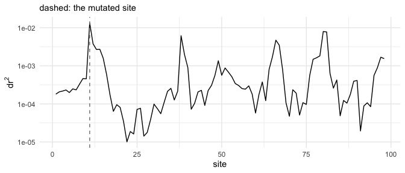

<!-- README.md is generated from README.Rmd. Please edit that file and knit. -->

# penm

<!-- badges: start -->

[](https://github.com/jechave/penm/actions/workflows/R-CMD-check.yaml)
<!-- badges: end -->

Given an elastic network model of a protein, `penm` builds the model of
a mutant. The mutant is itself a protein: its structure, energy and
normal modes are computed exactly as the wild type’s, the two can be
compared, and it can be mutated in turn.

By default, mutations follow the linearly forced ENM of Echave (2008)
and Echave & Fernández (2010). The model has no amino acids: mutating a
site perturbs the rest lengths of the springs connected to it, and the
structure relaxes to a new equilibrium. A second mutational model, a
generalized ENM (`mut_model = "genm"` in `set_enm()`), lets the force
constants follow the rest lengths and finds each mutant’s structure as
the minimum of its energy; see `vignette("genm")`.

## Installation

``` r
# install.packages("remotes")
remotes::install_github("jechave/penm")
```

## Usage

`set_enm()` builds a network from a `bio3d` pdb object. The bundled
`pdb_2acy_A` stands in for `bio3d::read.pdb("your.pdb")`.

``` r
library(penm)

wt <- set_enm(pdb_2acy_A, node = "ca", model = "ming_wall",
              d_max = 10.5, ensemble = 1)

mut <- get_mutant_site(wt, site_mut = 11, mutation = 1)
```

The same functions apply to either protein:

``` r
c(wt = get_nsites(wt),  mut = get_nsites(mut))
#>  wt mut 
#>  98  98
c(wt = enm_v_min(wt),   mut = enm_v_min(mut))
#>       wt      mut 
#> 0.000000 2.068515
```

The `delta_*` families compare them, by site or by normal mode:

``` r
dr2i <- delta_structure_dr2i(wt, mut)   # deformation per site
sum(dr2i)
#> [1] 0.05350642
```

``` r
library(ggplot2)

ggplot(tibble::tibble(site = get_site(wt), dr2 = dr2i), aes(site, dr2)) +
  geom_line() +
  geom_vline(xintercept = 11, linetype = "dashed", colour = "grey50") +
  scale_y_log10() +
  labs(x = "site", y = expression(dr^2), subtitle = "dashed: the mutated site") +
  theme_minimal()
```



Mutating the mutant, and so on, traces an evolutionary trajectory;
`vignette("penm")` covers that and the rest of the measures.

## Learn more

- `vignette("penm")` — build, mutate, measure, and a trajectory.
- `?penm` — the function map.

## References

Echave J (2008). Evolutionary divergence of protein structure: the
linearly forced elastic network model. *Chemical Physics Letters*
**457**(4–6), 413–416. <doi:10.1016/j.cplett.2008.04.042>

Echave J, Fernández FM (2010). A perturbative view of protein structural
variation. *Proteins* **78**(1), 173–180. <doi:10.1002/prot.22553>

`citation("penm")` gives these in BibTeX.
