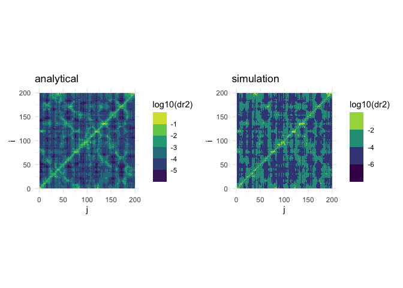

penm package
================
Julian Echave
26/09/2022

<!-- README.md is generated from README.Rmd. Please edit that file -->

The `penm` package contains functions to build Elastic Network Models
(ENM) of proteins and to perturb them; `penm` stands for Perturbing
Elastic Network Models.

# Overview

In short:

-   `bio3d::read.pdb()`: Set up a **pdb** protein object.
-   `set_enm()`: Set up a `penm` **prot** object, containing protein and
    its ENM info.
-   `amrs()`and `smrs()`: perform single-mutation scans to calculate
    mutation-response matrices.
-   `admrs()`and `sdmrs()`: perform double-mutation scans to calculate
    compensation matrices.

# Installation

Install packages `penm` (this package) and `jefuns` (miscelaneous
functions, some of which `penm` uses).

    # install.packages("devtools")

    devtools::install_github("jechave/jefuns")
    devtools::install_github("jechave/penm")

# Getting started

Before using the package, it needs to be loaded. To run this file, also
load the following packages: `tidyverse`, `patchwork`, and `jefuns`.

``` r
library(tidyverse)  
#> ── Attaching packages ─────────────────────────────────────── tidyverse 1.3.1 ──
#> ✔ ggplot2 3.3.6      ✔ purrr   0.3.4 
#> ✔ tibble  3.1.8      ✔ dplyr   1.0.10
#> ✔ tidyr   1.2.1      ✔ stringr 1.4.0 
#> ✔ readr   2.1.2      ✔ forcats 0.5.1
#> ── Conflicts ────────────────────────────────────────── tidyverse_conflicts() ──
#> ✖ dplyr::filter() masks stats::filter()
#> ✖ dplyr::lag()    masks stats::lag()
library(patchwork)  
library(jefuns)
library(penm)
```

## Set up the ENM for a protein

First, read a pdb file using `bio3d::read.pdb` to generate a `pdb`
object for a protein. Then, create the `prot` object, that contains the
full ENM analysis.

``` r
pdb <-  bio3d::read.pdb("data-raw/2XWRa.pdb") # read a pdb file
#>    PDB has ALT records, taking A only, rm.alt=TRUE
wt <- set_enm(pdb, node = "calpha", model = "anm", d_max = 10.5, frustrated = FALSE)
```

`wt` created here by `set_enm()` is an object of class *prot*. In this
example, network nodes are placed at

coordinates, the model used is Bahar’s Anisotropic Network Model
(`model = "anm"`) with a cut-off distance to define contacts of
`d_max = 10.5`. `frustrated` indicates whether to add frustrations to
the model (it defaults to `FALSE`, it may be ommited from the list of
arguments).

The object `wt` created above is a list that contains several
components:

``` r
str(wt) # show structure of the object created
#> List of 6
#>  $ param:List of 4
#>   ..$ node      : chr "calpha"
#>   ..$ model     : chr "anm"
#>   ..$ d_max     : num 10.5
#>   ..$ frustrated: logi FALSE
#>  $ nodes:List of 5
#>   ..$ nsites  : int 199
#>   ..$ site    : int [1:199] 1 2 3 4 5 6 7 8 9 10 ...
#>   ..$ pdb_site: int [1:199] 91 92 93 94 95 96 97 98 99 100 ...
#>   ..$ bfactor : num [1:199] 24.1 26.2 19.7 19.8 19 ...
#>   ..$ xyz     : num [1:597] -25.3 24.7 -48.8 -27 25.1 ...
#>  $ graph: tibble [1,970 × 8] (S3: tbl_df/tbl/data.frame)
#>   ..$ edge: chr [1:1970] "1-2" "1-3" "1-4" "1-81" ...
#>   ..$ i   : int [1:1970] 1 1 1 1 1 1 1 1 2 2 ...
#>   ..$ j   : int [1:1970] 2 3 4 81 82 83 84 122 3 4 ...
#>   ..$ v0ij: num [1:1970] 0 0 0 0 0 0 0 0 0 0 ...
#>   ..$ sdij: int [1:1970] 1 2 3 80 81 82 83 121 1 2 ...
#>   ..$ lij : num [1:1970] 3.82 6.48 9.49 8.31 8.11 ...
#>   ..$ kij : num [1:1970] 1 1 1 1 1 1 1 1 1 1 ...
#>   ..$ dij : num [1:1970] 3.82 6.48 9.49 8.31 8.11 ...
#>  $ eij  : num [1:1970, 1:3] -0.447 -0.383 -0.635 -0.293 -0.628 ...
#>  $ kmat : num [1:597, 1:597] 2.6679 1.942 -1.1157 -0.1998 0.0439 ...
#>  $ nma  :List of 4
#>   ..$ mode  : int [1:591] 1 2 3 4 5 6 7 8 9 10 ...
#>   ..$ evalue: num [1:591] 0.088 0.0928 0.1167 0.1268 0.1427 ...
#>   ..$ cmat  : num [1:597, 1:597] 1.513 -0.987 0.368 0.393 -0.226 ...
#>   ..$ umat  : num [1:597, 1:591] 0.02607 -0.00897 -0.02868 0.03198 -0.00398 ...
#>  - attr(*, "class")= chr [1:2] "prot" "list"
```

-   `wt$param` is a list of model parameters
-   `wt$nodes` has information on number of sites, site-indexes,
    B-factors, and cartesian coordinates of the nodes
-   `wt$graph` is a graph representation of the elastic network (used
    internally)
-   `wt$eij` is a matrix of unit vectors directed along contacts (used
    internally)
-   `wt$kmat` is the network’s matrix (also called the Hessian,
    Laplacian, or Kirchhoff matrix)
-   `wt$nma` has various properties obtained from a so called
    “normal-mode analysis”: mode index, eigenvalues (`evalue`), matrix
    of eigenvectors (`umat`), and the ENM’s variance covariance matrix
    (`cmat`).

## Single-site mutation-response scanning

There’re two methods of scanning mutations to obtain mutation-response
matrices, an analytical method, `amrs()`, and a simulation-based method
`smrs`. The analytical method uses a theoretical formual to calculate
the response averaged over mutations. The simulation method introduces a
given number of mutations, calculates the responses, then averages.

``` r
# Calculate analytical mutation-response matrix for deformations (response = "dr2")

dr2ij_analytical <- amrs(wt, mut_dl_sigma = 0.3, mut_sd_min = 1, option = "site", response = "dr2")

# Calculate simulation mutation-response matrix for deformations (response = "dr2")

dr2ij_simulation <- smrs(wt, nmut = 10, mut_dl_sigma = 0.3, mut_sd_min = 1, option = "site", response = "dr2", seed = 1024)

# Plot both matrices side by side

p_analytical <- plot_matrix(log10(dr2ij_analytical), value_name = "log10(dr2)") + 
  ggtitle("analytical")

p_simulation <- plot_matrix(log10(dr2ij_simulation), value_name = "log10(dr2)") + 
  ggtitle("simulation")

p_analytical + p_simulation 
```

<!-- -->

### Three responses: structure, energy, and force

There are three possible responses that can be calculated:

-   `response = "dr2"` (structural deformations): Matrix element
    `m[i,j]` represents the square distance between site `i` of the
    wild-type protein and site `i` of the mutant, averaged over
    mutations at site `j`.
-   `response = "de2"` (deformation energy): `m[i,j]` is the mechanical
    energy needed to movoe site `i` back to its unperturbed position,
    averaged over mutations at site `j`).
-   `response = "df2"` (force): `m[i,j]` is the square-length of the
    mechanical force vector acting on site `i`, averaged over mutations
    at site `j`).

``` r
# Calculate analytical mutation-response matrix for deformations (response = "dr2")

dr2ij <- amrs(wt, mut_dl_sigma = 0.3, mut_sd_min = 1, option = "site", response = "dr2")
de2ij <- amrs(wt, mut_dl_sigma = 0.3, mut_sd_min = 1, option = "site", response = "de2")
df2ij <- amrs(wt, mut_dl_sigma = 0.3, mut_sd_min = 1, option = "site", response = "df2")

# Plot matrices 

p_dr2 <- plot_matrix(log10(dr2ij), value_name = "log10(dr2)") +  ggtitle("structure") +
  theme(legend.position = "none")
p_de2 <- plot_matrix(log10(de2ij), value_name = "log10(de2)") +  ggtitle("energy") +
  theme(legend.position = "none")
p_df2 <- plot_matrix(log10(df2ij), value_name = "log10(df2)") +  ggtitle("force") +
  theme(legend.position = "none")

p_dr2 + p_de2 + p_df2 
```

<!-- -->

### Response in normal-mode coordinates

Above, each row represents a site. It is also possible to calculate
responses (structure, energy, or force), in the direction of the normal
modes, using `option = "mode"`:

``` r
# Calculate analytical mutation-response matrix for deformations (response = "dr2")

dr2ij <- amrs(wt, mut_dl_sigma = 0.3, mut_sd_min = 1, option = "mode", response = "dr2")
de2ij <- amrs(wt, mut_dl_sigma = 0.3, mut_sd_min = 1, option = "mode", response = "de2")
df2ij <- amrs(wt, mut_dl_sigma = 0.3, mut_sd_min = 1, option = "mode", response = "df2")

# Plot matrices 

p_dr2 <- plot_matrix(log10(dr2ij), row_name = "mode", value_name = "log10(dr2)") +  
  ggtitle("structure") + theme(legend.position = "none")

p_de2 <- plot_matrix(log10(de2ij), row_name = "mode", value_name = "log10(de2)") + 
  ggtitle("energy") + theme(legend.position = "none")
p_df2 <- plot_matrix(log10(df2ij), row_name = "mode", value_name = "log10(df2)") +  
  ggtitle("force") + theme(legend.position = "none")

p_dr2 + p_de2 + p_df2 
```

<!-- -->

## Double-site mutation-response scanning

Double mutation-response scanning produces a so-called “compensation
matrix”. This matrix can be obtained using `admrs()` (analytical
method), or `sdmrs()` (simulation method). An element `d[i,j]` of the
matrix obtained represents the maximum compensation due to mutations at
`j` of an original mutation at `i`. If `option = "mean_max"`is used, the
average over `i` is returned. If
`option =`max_max`, then the maximum over mutations at`i\` is returned.

``` r
# Calculate analytical double mutation-response matrix for deformations (response = "dr2")

D_analytical <- admrs(wt, mut_dl_sigma = 0.3, mut_sd_min = 1, option = "mean_max", response = "dr2")

# Calculate simulation mutation-response matrix for deformations (response = "dr2")

D_simulation <- sdmrs(wt, nmut = 5, mut_dl_sigma = 0.3, mut_sd_min = 1, option = "mean_max", response = "dr2", seed = 1024)

# Plot both matrices side by side

p_analytical <- plot_matrix(log10(D_analytical), value_name = "log10(Dij)") + 
  ggtitle("analytical")

p_simulation <- plot_matrix(log10(D_simulation), value_name = "log10(Dij)") + 
  ggtitle("simulation")

p_analytical + p_simulation 
```

<!-- --> \### Compensation
matrices averaged or maximized over initial mutation

Site `j` (columns of the compensaton matrix) are candidate “rescue”
sites, therefore the compensation matrix looks for the maximum over
possible mutations. Site `i` is the originally mutated site. To
eliminate the *specific* mutation at `i`, there are two ways: maximize
(i.e. pick the mutation at `i` that is most easily compensated by a
mutation at `j`) or average. These two options are implemented:

``` r
# Calculate analytical mutation-response matrix for deformations (response = "dr2")

Dij_mean_max <- admrs(wt, mut_dl_sigma = 0.3, mut_sd_min = 1, option = "mean_max", response = "dr2")
Dij_max_max <- admrs(wt, mut_dl_sigma = 0.3, mut_sd_min = 1, option = "max_max", response = "dr2")

# Plot matrices 

p_mean_max <- plot_matrix(log10(Dij_mean_max), value_name = "log10(Dij)") +  ggtitle("mean_max") 
p_max_max <- plot_matrix(log10(Dij_max_max), value_name = "log10(Dij)") +  ggtitle("max_max") 

p_mean_max + p_max_max
```

<!-- -->

### Compensation matrices for structure, energy, and force

As above, three compensation matrices can be calculated.

``` r
# Calculate analytical mutation-response matrix for deformations (response = "dr2")

dr2ij <- admrs(wt, mut_dl_sigma = 0.3, mut_sd_min = 1, option = "mean_max", response = "dr2")
de2ij <- admrs(wt, mut_dl_sigma = 0.3, mut_sd_min = 1, option = "mean_max", response = "de2")
df2ij <- admrs(wt, mut_dl_sigma = 0.3, mut_sd_min = 1, option = "mean_max", response = "df2")

# Plot matrices 

p_dr2 <- plot_matrix(log10(dr2ij), value_name = "log10(dr2)") +  ggtitle("structure") +
  theme(legend.position = "none")
p_de2 <- plot_matrix(log10(de2ij), value_name = "log10(de2)") +  ggtitle("energy") +
  theme(legend.position = "none")
p_df2 <- plot_matrix(log10(df2ij), value_name = "log10(df2)") +  ggtitle("force") +
  theme(legend.position = "none")

p_dr2 + p_de2 + p_df2 
```

<!-- -->
