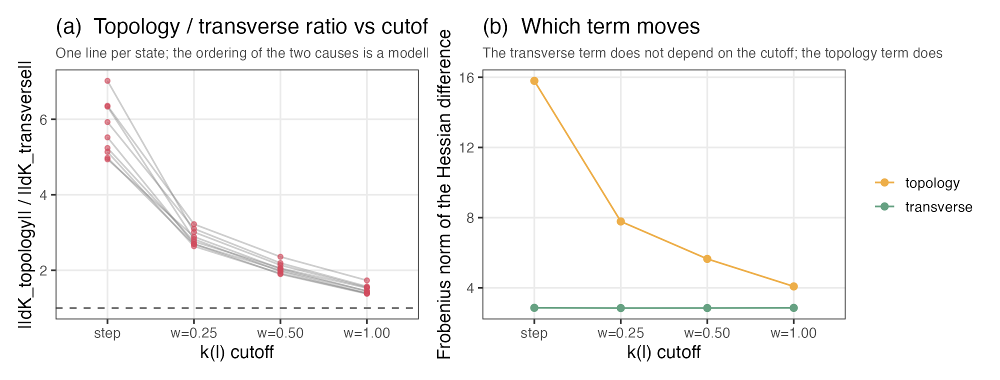
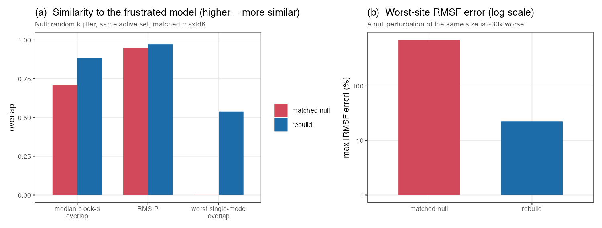

# An elastic network model with k(l): building it, and what it does

2026-08-25. Acylphosphatase, 2acy chain A: 98 residues, 960 contacts at
$d_{\max} = 10.5$ Å, uniform $k_{ij} = 1$ (ANM). Everything seeded and
reproducible from `analyses/`.

---

## 1. What this is

An elastic network model in which the spring constants depend on the rest
lengths, $k_{ij}(l_{ij})$, rather than on the equilibrium distances. The rest
lengths are then the only parameters, and the contact map follows from them
rather than from the structure.

Mutants are made by perturbing rest lengths and **minimising the energy
numerically**. No linear response and no expansion of any kind enters the
dynamics; the quadratic expansion is used only to look at states already
accepted.

What follows is the model and five things measured with it:

| | |
|---|---|
| §2 | the model: potential, state, mutation, energy differences |
| §3 | **trajectories** — do they run, and what do they do |
| §4 | **scans** — site profiles of energy, structure and entropy, with $k(l)$ live and frozen |
| §5 | **contact-map statistics** — how often, and in which direction, mutation rewires the network |
| §6 | **refitting a strained structure** — does discarding frustration change the motions |
| §7 | what these say together |

§6 is the longest section because it needed two controls before its answer could
be trusted, not because it is the most important.

### Results in brief

1. **Trajectories run.** No stalling at any selection strength tried, and they
   keep producing strained structures indefinitely (§3). The reason they do not
   stall is that strain *widens* the distribution of $\Delta V$ without shifting
   its mean: a strained network survives on its left tail, not by drifting
   downhill.
2. **Energy profiles barely notice $k(l)$; entropy profiles do.** Site profiles
   of the energy cost of mutation are almost unchanged when $k$ is allowed to
   follow $l$ (correlation 0.974), and reproduce the standard results — buried
   sites cost more to mutate and move less. The range of $\Delta(TS)$ across
   sites widens 6.25-fold (§4). Adding or removing a spring changes the spectrum
   far more than moving a rest length does.
3. **The contact map moves constantly.** At the working mutation size,
   three-quarters of mutations change it, with gains and losses balanced, so the
   network rewires rather than erodes (§5).
4. **Frustration can be neglected.** Refitting an ENM to a strained structure —
   standard practice — preserves the RMSF profile and the soft-mode subspace,
   and does so far better than a random perturbation of the same size would (§6).
5. **But most of what refitting changes is not frustration.** It is the contact
   map being re-derived. Under a hard cutoff that term is 5.5× the frustration
   term; under a soft one the two are comparable. Which dominates is a modelling
   choice, usually made without comment (§6).

---

## 2. A model whose parameters are the rest lengths

### 2.1 The potential

$$V(\mathbf r; \{l_{ij}\}) \;=\; V_0 \;+\; \tfrac12 \sum_{i<j} k_{ij}(l_{ij})\,\big(d_{ij}(\mathbf r) - l_{ij}\big)^{2}$$

The rest lengths are the only parameters. The single departure from a standard
ENM is that the spring constant is a function of the **rest length**,
$k_{ij}(l_{ij})$, not of the equilibrium distance $k_{ij}(d^{e}_{ij})$.

At the wild type these are the same function, since the fit sets
$l_{ij} = d^{e}_{ij}$. They differ only for a mutant, and then in a way that
matters:

> **the contact map becomes a property of the parameters, not of the structure.**

Contacts are made and broken by *mutation*, when an $l_{ij}$ crosses the cutoff —
not by relaxation. For the ANM,
$k_{ij}(l_{ij}) = \mathbb 1[l_{ij} \le d_{\max}]$, with backbone neighbours
always bonded. A pair with $k_{ij} > 0$ is **active**; the active pairs are the
contact map. $V_0 = 0$ throughout, so $V$ of a state is exactly its strain energy.

### 2.2 The state

A state carries $l_{ij}$ for **all** $N(N-1)/2 = 4753$ pairs, not just the 960
active ones, initialised to $l_{ij} = d_{ij}(\mathbf r^{e}_{\text{wt}})$.

This is forced, not convenient. Every *active* wild-type pair has
$l_{ij} \le d_{\max}$ by construction, so if only active pairs carried a rest
length no inactive pair could ever be pulled inside the cutoff, and the network
could only thin. Carrying all pairs makes breaking and forming symmetric. The
cost is negligible: a force evaluation over 4753 pairs takes ~4 ms against 30 ms
for one diagonalisation, and the Hessian stays $3N\times3N$ because only active
pairs contribute.

### 2.3 One mutation

Pick a site $j$; perturb the rest length of every pair involving $j$ by
$\delta l_{ij} \sim \mathcal N(0,\sigma^2)$; recompute $k_{ij}(l_{ij})$;
**minimise $V$ numerically** for $\mathbf r^{e}_{\text{mut}}$; evaluate $V$
exactly there. $\sigma = 0.3$ Å unless stated.

### 2.4 The discipline

**No expansion ever conditions the dynamics.** The structure comes from
minimising $V$ — not linear response, not $\mathbf C_{\text{wt}}\mathbf f$, not a
two-term formula. Energies are read at the minimum. Normal modes are computed
only to *observe* a state already accepted.

This is affordable: one exact minimisation converges in 4–20 Newton steps at
~0.25 s, so a trajectory runs at ~4 proposals per second. There is no performance
argument for the linear-response shortcut.

### 2.5 Energy differences

The reference is always named, because along a trajectory it is a strained state,
not the founder:

$$\Delta V_{\text{stress}} = V_{\text{mut}}(\mathbf r_{\text{ref}}) - V_{\text{ref}}(\mathbf r_{\text{ref}})$$
$$\Delta V_{\text{relax}} = V_{\text{mut}}(\mathbf r^{e}_{\text{mut}}) - V_{\text{mut}}(\mathbf r_{\text{ref}})$$
$$\Delta V_{\min} = V_{\text{mut}}(\mathbf r^{e}_{\text{mut}}) - V_{\text{ref}}(\mathbf r^{e}_{\text{ref}}) = \Delta V_{\text{stress}} + \Delta V_{\text{relax}}$$

Two Hamiltonians at one structure; one Hamiltonian at two structures; the
difference of minima, which is what a trajectory accepts on. All computed by
evaluating Hamiltonians, never a closed form — at a strained reference a closed
form needs a cross term, and here further terms because
$k^{\text{mut}}_{ij} \ne k^{\text{ref}}_{ij}$.

Dropping the $\Delta$ is not a notational nicety. Fifteen substitutions along,
$V_{\text{mut}}(\mathbf r_{\text{ref}}) = 7.90$ while
$\Delta V_{\text{stress}} = 1.06$ — a sevenfold difference, exactly
$V_{\text{ref}}$, growing with the walk.

### 2.6 Definitions

**Strain**, two measures: $s_{\max} = \max_{ij}|d_{ij}(\mathbf r^e) - l_{ij}|$
in Å, and $E_{\text{strain}} = \frac12\sum k_{ij}(d_{ij}(\mathbf r^e)-l_{ij})^2$,
equal to $V$ since $V_0 = 0$.

**Frustration**: no conformation relaxes every spring at once, i.e.
$E_{\text{strain}} > 0$ at the minimum.

**Hessian**, for an active pair,

$$\mathbf K_{ij} = -k_{ij}\Big[\hat{\mathbf e}_{ij}\hat{\mathbf e}_{ij}^{\mathsf T} + g_{ij}\big(\hat{\mathbf e}_{ij}\hat{\mathbf e}_{ij}^{\mathsf T} - \mathbf I\big)\Big], \qquad g_{ij} = \frac{l_{ij}}{d_{ij}(\mathbf r)} - 1$$

with $\mathbf K_{ii} = -\sum_{j\ne i}\mathbf K_{ij}$. The $g_{ij}$ piece is the
**transverse term**; it vanishes exactly when a spring is at its rest length, so
**frustration reaches the dynamics only through $g_{ij}$**. Standard ENMs drop it
because for them it is identically zero.

**RMSF** of site $i$: $\sqrt{\langle|\delta\mathbf r_i|^2\rangle}$, from the
$3\times3$ diagonal block of $\mathbf C = \beta^{-1}\mathbf K^{+}$.

**RMSIP** over $M=20$ modes:
$\sqrt{M^{-1}\sum_{a,b}(\mathbf u^A_a\cdot\mathbf u^B_b)^2}$. It scores a
*subspace*.

**Mode matching** is a one-to-one assignment maximising total overlap
(`clue::solve_LSAP`), not row-wise maxima, which are not a matching and inflate
overlaps.

$\beta = 1$ wherever entropy appears — with $k_{ij} = 1$ this is a convention,
not a physical temperature.

---

## 3. Trajectories


**Question.** Does a walk in this model run at all — and if it does, what keeps
it running when every mutation is uphill from a relaxed network?

**What I did.** From the wild type, repeatedly: draw a site uniformly, mutate it
(§2.3), minimise exactly, accept with probability
$\min\{1, e^{-\nu\Delta V_{\min}}\}$ measured against the *current* state. A
neutral walk sets $\nu = 0$ and accepts everything. 120 substitutions at three
selection strengths, seeds $300+10\nu$.


**Figure 1.** Three walks at $\nu = 0.5, 1, 4$ (colour), 120 accepted
substitutions each, $\sigma = 0.3$. $x$ is accepted substitutions, not proposals.
**(a)** $V$ relative to the founder — since $V_0 = 0$, the state's strain energy.
**(b)** RMSD from the founder after rigid-body superposition, Å. **(c)** Number
of active pairs; the wild type has 960.

**Result.**

| $\nu$ | final $E_{\text{strain}}$ | final $s_{\max}$ (Å) | active pairs | acceptance |
|---|---|---|---|---|
| 0.5 | 57.85 | 1.479 | 958 | 0.727 |
| 1 | 54.26 | 1.307 | 942 | 0.612 |
| 4 | 27.76 | 0.977 | 947 | 0.198 |

No run stalled. Selection sets the energy level; the network ends within 2 % of
its starting size in every case.

**What it means.** The walks produce genuinely strained states — $s_{\max}$ of
1–1.5 Å against a 10.5 Å cutoff — and keep producing them indefinitely.

An earlier exploration (`sclfenm/MODEL.md` §6) proves that from a *relaxed*
network, $\Delta V_{\min} \ge 0$ always. Its hypothesis fails here after the first
mutation, so the question is empirical.

**What I did.** One neutral walk, 40 substitutions, seed 2, saving every 10. From
each saved state (and from the wild type), 200 fresh trial mutations, each
minimised exactly, $\Delta V_{\min}$ recorded and the trial discarded.


**Figure 2.** $x$ is $E_{\text{strain}}$ of the reference state. **(a)** Percent
of the 200 trials with $\Delta V_{\min} < 0$. **(b)** Mean (blue) and minimum
(red) of the same 200 values.

| substitutions | $E_{\text{strain}}$ | mean $\Delta V_{\min}$ | min | fraction $<0$ |
|---|---|---|---|---|
| 0 (founder) | 0.00 | +0.609 | **+0.131** | **0.000** |
| 20 | 11.23 | +0.615 | −0.124 | 0.015 |
| 40 | 24.28 | +0.614 | −0.604 | 0.045 |

From the relaxed founder not one of 200 mutations is downhill; from a strained
state a few per cent are. The mean is unmoved at ~0.61 throughout: **strain
widens the distribution rather than shifting it**, so the walk keeps finding
acceptable moves without drifting downhill.

---

## 4. Scans: site profiles under a single mutation

**What I did.** Mutate each of the 98 sites 8 times from the fixed wild type
($\sigma = 0.3$, seed 11), minimise each exactly, discard, average per site.
Repeat with $k_{ij}$ frozen at wild-type values — same seed, hence the same
perturbations — so the two differ only through $k(l)$.


**Figure 3.** Blue = $k_{ij}(l_{ij})$ live, red = frozen. **(a)**
$\Delta V_{\min}$ per site. **(b)** The same against the mutated site's contact
number. **(c)** $\Delta(TS)$ per site, $\beta = 1$.

| (over the 98 sites) | $k_{ij}(l_{ij})$ live | $k_{ij}$ frozen |
|---|---|---|
| $\operatorname{cor}(\Delta V_{\min}, cn_j)$ | +0.928 | +0.946 |
| $\operatorname{cor}(\lvert\delta\mathbf r_j\rvert^2, cn_j)$ | −0.657 | −0.712 |
| range of $\Delta(TS)$ | **0.765** | **0.122** |

Both reproduce the standard results — buried sites cost more to mutate and move
less. The energy profiles agree closely (correlation 0.974). The entropy range
differs 6.25-fold: this is where the contact map shows up.

## 5. How the contact map moves

**Question.** If $k_{ij}(l_{ij})$ never changed the active set, the model would
be an ordinary ENM with extra bookkeeping. How often does it change it, and does
the network rewire or simply erode?

**What I did.** From the wild type, mutate one uniformly chosen site (§2.3),
recompute $k_{ij}$, compare active sets. No minimisation — this is a property of
the parameters alone. 200 draws at each $\sigma$, seed 1.


**Figure 4. (a)** Fraction of the 200 draws changing the active set, log $x$;
dashed line at the working $\sigma = 0.3$. **(b)** Mean pairs gained (green) and
lost (red) per mutation.

| $\sigma$ | changing the active set | broken | formed |
|---|---|---|---|
| 0.01 | 3.5 % | 0.030 | 0.005 |
| 0.10 | 35.5 % | 0.175 | 0.275 |
| **0.30** | **74 %** | **0.71** | **0.67** |
| 0.60 | 93 % | 1.21 | 1.28 |

At the working $\sigma$, three-quarters of mutations rewire the network, and
gains and losses are balanced — it rewires rather than erodes.

## 6. Refitting a strained structure

**Question.** Take a strained state, refit an ENM to its coordinates the way
everyone does, and ask how different the resulting dynamics is.

**What I did.** Three independent neutral walks of 60 substitutions (seeds
501–503), saving every 10 — **18 states**. At each, two models built **at the
same coordinates**:

| | rest lengths | active set | transverse term |
|---|---|---|---|
| **frustrated** | the state's own $l_{ij}$ | from $k_{ij}(l_{ij})$ | $g_{ij}\ne0$ |
| **rebuilt** | reset to $d_{ij}$ here | re-derived from the structure | $g_{ij}=0$ |

The rebuilt model uses only the coordinates: it is the standard construction.
Both were verified at a true minimum with exactly six zero modes before anything
was measured — off a stationary point the frustrated Hessian acquires spurious
near-zero and negative eigenvalues, and RMSF $\sim 1/\lambda$ then diverges.


**Figure 5.** Rebuild error against accumulated strain, 18 states pooled from
three walks (not 18 independent draws). $x$ is $E_{\text{strain}}$. Colours
decompose the difference: **green** = transverse term alone (same active set,
$g_{ij}\ne0$ vs $g_{ij}=0$); **yellow** = active set alone (both $g_{ij}=0$);
**red** = both, the full rebuild. Lines are loess guides. **(a)** Largest
relative RMSF error over the 98 sites. **(b)** Overlap of the least-preserved
mode among the 20 softest. **(c)** That worst-mode overlap (red) beside RMSIP
over all 20 (blue), full rebuild only.

**Result.**

| | median over 18 states | range |
|---|---|---|
| RMSF profile correlation | 0.982 | 0.961–0.995 |
| worst-site RMSF error | 22.7 % | 7.6–32.9 % |
| RMSIP, 20 softest modes | 0.973 | 0.956–0.995 |
| block-5 mode overlap | 0.928 | 0.844–0.965 |
| max eigenvalue difference | 20.1 % | up to 76.3 % |
| $TS_{\text{rebuilt}} - TS_{\text{frustrated}}$ | −4.57 | −6.34 to −0.44 |
| net change in active pairs | +25 | +1 to +30 |

Every one is monotone in substitution number ($|\mathrm{cor}| \approx 0.87$), so
these medians are properties of the sampling grid: sampled at 10–30 the median
$\Delta TS$ is −2.09, at 40–60 it is −5.53. The trend against strain in figure 5
is what carries meaning.


**Figure 6.** One state in detail — seed 501 at 60 substitutions,
$E_{\text{strain}} = 36.1$, the *most strained* of the 18 and deliberately not
typical. **(a)** Signed relative RMSF error at each of the 98 sites: the profile
correlation is 0.983 and site 92 is still off by −20.2 %. **(b)** Overlap of each
of the 20 softest modes with its assigned partner; dashed line is RMSIP $=0.960$.
The panel shows what a subspace score averages over. It is **not** evidence that
the rebuild destroys modes — see §6.2.

**What it means, provisionally.** Aggregate measures survive well; site-resolved
ones are perturbed by tens of per cent; the entropy moves by several units. Two
questions must be answered before any of that can be interpreted: *which*
difference between the models causes it (§6.1), and whether an error of this
size is even large (§6.2).

---

### 6.1 Is it the frustration, or the contact map?

**Question.** The rebuild changes two things at once: it zeroes the transverse
term *and* re-derives the active set. Only the first is "neglecting frustration".
Which one does the damage?

**What I did.** Split the difference into the two steps and measure each. On the
Hessian the split is exact by construction,

$$(\mathbf K_{\text{frust}} - \mathbf K_{g=0}) + (\mathbf K_{g=0} - \mathbf K_{\text{rebuilt}}) = \mathbf K_{\text{frust}} - \mathbf K_{\text{rebuilt}}$$

verified to $2.2\times10^{-16}$, so Frobenius norms of the two pieces compare
fairly. Then — suspecting the answer might depend on the ANM's hard cutoff — I
repeated the whole decomposition with $k_{ij}(l_{ij})$ replaced by a sigmoid of
width $w$,

$$k_{ij}(l_{ij}) = \big[1 + \exp\!\big((l_{ij} - d_{\max})/w\big)\big]^{-1}$$

applied to **both** models, so they still differ only in $l_{ij}$ and what
follows from it.

**Result.** Under the ANM step, the active-set change is much the larger:

| | transverse | active set | full | $\sqrt{\text{tr.}^2+\text{a.s.}^2}$ |
|---|---|---|---|---|
| median | 2.53 | **15.09** | 15.31 | 15.38 |

The two add in quadrature to within 0.34 %, so they are nearly orthogonal
perturbations, and the ratio is 5.6.

But **every edge on which the two active sets disagree is a marginal contact**.
At seed 501/40, of 59 differing edges: gained pairs lie inside the cutoff by a
median of 0.21 Å, lost pairs outside it by 0.09 Å, **100 % lie within 1.0 Å of
$d_{\max}$**, 90 % within 0.5 Å, and together they hold 5.9 % of the state's
energy. The step function counts each at full strength $k_{ij}=1$, so a pair at
10.4999 Å enters the Hessian as heavily as a core contact.



**Figure 7.** The same three walks sampled every 20 (9 states), re-expressed
under four kernels. **(a)** One grey line per state across the four cutoffs; $y$
is $\lVert\Delta\mathbf K_{\text{active set}}\rVert_F/\lVert\Delta\mathbf K_{\text{transverse}}\rVert_F$,
dashed line at 1. **(b)** The two norms separately: transverse (green) flat by
construction, active set (yellow) falling fourfold.

| cutoff | transverse | active set | ratio |
|---|---|---|---|
| step | 2.86 | 15.80 | **5.52** |
| sigmoid, $w = 0.25$ | 2.85 | 7.78 | 2.82 |
| sigmoid, $w = 0.50$ | 2.85 | 5.65 | 2.04 |
| sigmoid, $w = 1.00$ | 2.86 | 4.08 | **1.45** |

Monotone in $w$ in all 9 states.

**What it means.** *Under a hard cutoff*, re-deriving the contact map perturbs
the Hessian about 5.5× more than neglecting frustration does. But that factor is
a property of the ANM step function, not of the protein: soften the kernel and
the two become comparable. The transverse term is untouched throughout, as it
must be, since it does not involve the cutoff.

The honest statement is that the two effects are of comparable size, and any
claim that one dominates is a claim about the kernel.

---

### 6.2 Is the error large? A null control

**Question.** "The worst site is off by 23 %" means nothing without a scale. Is
that a lot, for a perturbation of this size, in a spectrum this dense?

**What I did.** Built a perturbation matched in magnitude and null in kind:
multiply the state's own spring constants by $1 + s\,z$, with $z$ a fixed vector
of standard normals and $s$ tuned by bisection until $\max|\Delta\mathbf K|$
matches the rebuild's to within 5 %. It changes no rest length, adds no
frustration, and leaves the active set intact (verified for all 27 draws). Three
null draws per state, 9 states.



**Figure 8.** Rebuild (blue) against matched null (red). **(a)** Similarity to
the frustrated model, higher = more similar: worst single-mode overlap, median
block-3 overlap, RMSIP. **(b)** Worst-site RMSF error, log axis.

**Result.**

| | rebuild | matched null |
|---|---|---|
| worst single-mode overlap | 0.539 | **0.001** |
| RMSIP over 20 modes | 0.971 | 0.949 |
| median block-3 overlap | 0.886 | 0.710 |
| worst-site RMSF error | 22.5 % | **698 %** |
| max eigenvalue difference | 0.221 | 0.997 |

**What it means.** A perturbation of the same size but arbitrary direction is
some thirty times more destructive. **The rebuild is a remarkably gentle
perturbation for its magnitude** — not merely "not too bad", but far better than
chance.

This also disposes of the individual mode overlaps. The rebuild shifts
eigenvalues by ~15 % while adjacent levels are separated by ~6 %; a perturbation
larger than the level spacing mixes eigenvectors within near-degenerate groups,
and which vector is called "mode 10" becomes bookkeeping. The null confirms it:
*any* perturbation of this size scrambles individual modes, and worse. Nothing
mode-resolved in §6 is evidence about frustration.

---

## 7. Conclusion

**Frustration can be neglected, and standard practice is better justified than
this exploration set out to test.**

Refitting an ENM to a strained structure preserves the RMSF profile (correlation
0.98), preserves the soft-mode subspace (RMSIP 0.97, block-5 overlap 0.93), and
does so far better than a random perturbation of the same magnitude would (§6.2).
What it costs is site-resolved accuracy — tens of per cent at the worst sites —
and a few units of $TS$.

Two qualifications matter more than the headline:

1. **Most of the difference is not frustration at all**, but the contact map
   being re-derived. Under a hard cutoff that term is 5.5× the frustration term;
   under a soft one they are comparable (§6.1). Which dominates is a modelling
   choice, usually made without comment.
2. **Individual normal modes of a perturbed ENM should not be read** — in this or
   any model with a spectrum this dense. The null control shows the low overlaps
   carry no information (§6.2).

The one place the contact map clearly does matter is entropy: letting $k_{ij}$
follow $l_{ij}$ widens the range of $\Delta(TS)$ across sites 6.25-fold while
leaving the $\Delta V$ profile essentially unchanged (correlation 0.974,
§4). Adding or removing a spring changes the spectrum far more than
moving a rest length does.

**What would settle it.** One protein, one cutoff, one $k$ model. The obvious
next step is §6.1's decomposition under a smooth kernel throughout, where the
frustration term may well become the interesting one.

---

## Appendix A. A smooth kernel

The step makes $V$ discontinuous in the parameters. Replacing it with the sigmoid
of §6.1 and running 40 substitutions at $\nu = 1$:

| | $E_{\text{strain}}$ | $s_{\max}$ over $k>0.5$ (Å) | acceptance |
|---|---|---|---|
| $w = 0.25$ | 20.97 | 0.810 | 0.571 |
| $w = 0.50$ | 21.49 | 1.057 | 0.482 |

**Not comparable with §3's table**: these ran 40 substitutions against 120, and
the sigmoid gives *every* pair $k_{ij} > 0$, so the network is fully connected
(4753 pairs against 960). A proper comparison needs the sigmoid thresholded so
the densities match. The kernel's effect where it does change a conclusion is
reported in §6.1.

## Appendix B. Verification

Three suites in `checks/`, all passing.

`test_core.R` — the wild-type state reproduces penm's ANM exactly (960 edges,
$\max|\Delta\mathbf K| = 3.6\times10^{-15}$ on a scale of 12.9); the minimiser
reaches $|\mathbf F| < 10^{-8}$ with exactly 6 zero modes; $\Delta V$ splits
exactly at both relaxed and strained references; $k_{ij} = k_{ij}(l_{ij})$ holds
after mutation; contacts break *and* form; mutation is exactly reversible in $l$,
$k$, internal structure and $V$.

`test_profiles.R` — the frustrated Hessian genuinely differs from the $g=0$ one;
six zero modes wherever a spectrum is taken; the rebuild is relaxed by
construction and does change the active set; mode matching is one-to-one; every
accepted trajectory state is at its own minimum.

`test_can_fail.R` — six deliberate sabotages, all detected. Including a
numerical-Hessian arbitration of the transverse sign on a *strained* network
(correct form off by $3.65\times10^{-6}$, flipped by $0.245$), and a
demonstration that off a stationary point the spectrum shows 4 zero modes and a
negative eigenvalue of $-4.8\times10^{-4}$.

## Appendix C. What I got wrong

Recorded because the corrections changed conclusions, not only numbers.

**The minimiser returned unconverged structures.** One draw in 200 from a
strained state hit the iteration limit at $|\mathbf F| = 2.4\times10^{3}$ and
yielded $\Delta V = 1.6\times10^{5}$, poisoning a mean into 778 where every other
value was 0.61. It now raises an error.

**$\Delta V_{\text{stress}}$ used the wild type's $k_{ij}$** — the LFENM
assumption $\delta k = 0$, false by construction here. It made a 26 % discrepancy
look like truncation error; with $k^{\text{mut}}_{ij}$ the gap is 0.009 %. I then
"fixed" the failing check by freezing $k$, bending the experiment to suit an
expansion this study exists to avoid.

**I concluded "topology dominates frustration by 5.6×"** without testing whether
the ratio depended on the kernel. It does, completely (§6.1).

**I read low mode overlaps as physical.** They are not; a null control shows any
perturbation of that size does worse (§6.2).

**Mode matching used row-wise maxima**, not a matching: 31 of 54 comparisons had
two modes claiming one partner, inflating every overlap.

**I quoted a block-5 overlap of 0.84 as "the defensible claim".** It is the worst
of 18 states; the median is 0.93.

Smaller: a claim that all wild-type $l_{ij} \le d_{\max}$ (true only of active
pairs — over all 4753 they reach 36.3 Å); a mechanism asserting active pairs
"cannot drift" (falsified by 66 lost edges); an unsourced count "318 to 228" that
no script produces; a transcription error in the sabotage figures.

## Appendix D. Limitations

- One protein, one cutoff, one $k$ model, one mutation size for the main result.
- $\beta = 1$ in ANM units is a convention; absolute $TS$ values are not physical.
- The 18 states are 3 walks × 6 correlated snapshots, not 18 independent draws;
  effective $n$ for trajectory-level statements is 3.
- Mutation perturbs all of a site's pairs (`radius = Inf`), so one mutation can
  reach across the protein.
- Trajectories are 40–120 substitutions at a single temperature; no phylogeny.
- The penm package is not modified. The frustrated Hessian is reimplemented here
  because `set_enm()` blocks `frustrated = TRUE`.

## Appendix E. Files

| | |
|---|---|
| `R/klfenm_core.R` | state, $k(l)$, energy, Hessian, exact minimiser, mutation |
| `R/klfenm_profiles.R` | per-site and per-mode comparisons |
| `R/klfenm_trajectory.R` | scans and walks |
| `analyses/run_all.R` | §§3–6.1 and Appendix A $\to$ `data/results.rds` (~45 min) |
| `analyses/run_control.R` | §6.2 $\to$ `data/control.rds` |
| `figures/make_figures.R` | the eight figures |
| `checks/` | `test_core.R`, `test_profiles.R`, `test_can_fail.R` |

```sh
Rscript analyses/run_all.R
Rscript analyses/run_control.R
Rscript figures/make_figures.R
```
