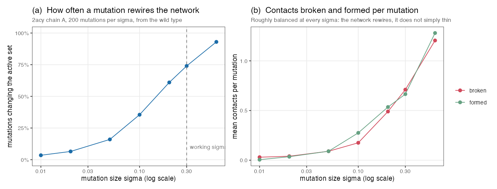
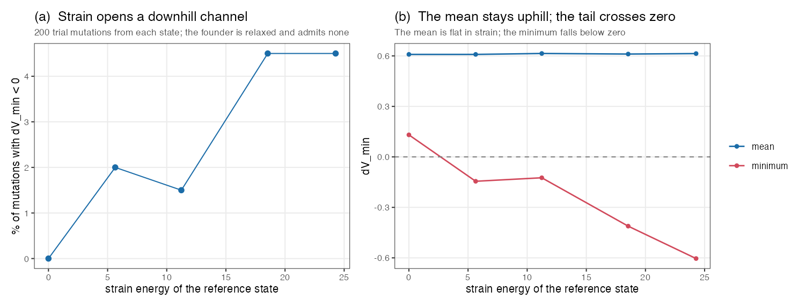
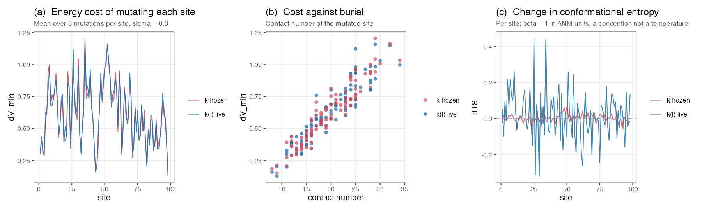
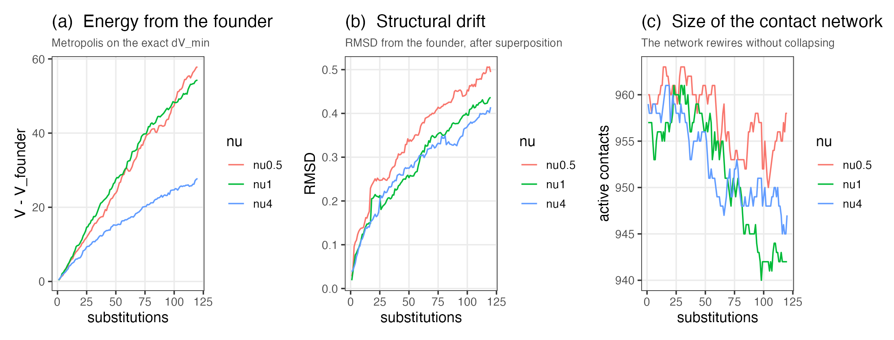
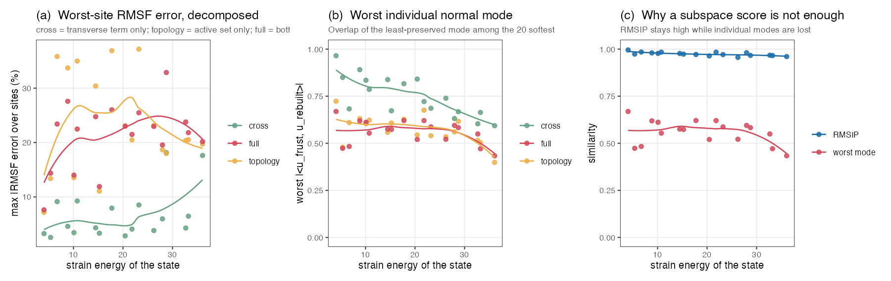
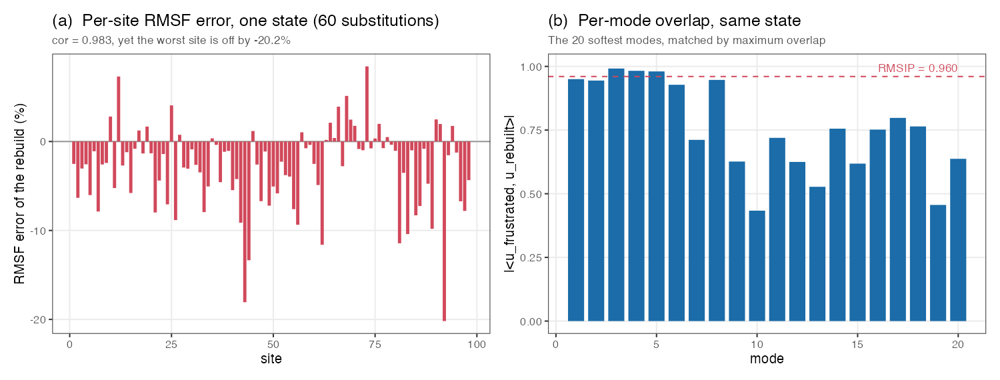

# An ENM whose parameters are the rest lengths

**Does frustration change the dynamics?** And what happens to a protein model
when the contact map is a property of the parameters rather than of the
structure.

2026-08-25. All numbers from acylphosphatase, 2acy chain A: 98 sites, 960
contacts at $d_{\max} = 10.5$ Å, uniform $k_{ij} = 1$ (ANM), mutation size
$\sigma = 0.3$ unless stated. Every script is seeded.

---

## 1. The model

The rest lengths are the only parameters. Everything else follows from them:

$$V(\mathbf r; \{l_{ij}\}) \;=\; V_0 \;+\; \tfrac12 \sum_{i<j} k_{ij}(l_{ij})\,\big(d_{ij}(\mathbf r) - l_{ij}\big)^{2}$$

The one change from a standard ENM is $k_{ij}(l_{ij})$ in place of
$k_{ij}(d^{e}_{ij})$. It gives identical $k_{ij}$ at the wild type, where the fit sets
$l_{ij} = d^{e}_{ij}$, and differs for a mutant, because now

> **the contact map is a property of the parameters, not of the structure.**

Contacts are made and broken by *mutation*, when an $l_{ij}$ crosses the cutoff.
They are not made or broken by relaxation.

For the ANM, $k_{ij}(l_{ij}) = \mathbb 1[l_{ij} \le d_{\max}]$, plus the usual
convention that backbone neighbours ($|i-j| = 1$) are always bonded. A pair with
$k_{ij} > 0$ is called **active**; the active pairs are the contact map.

### Definitions used throughout

**Strain.** A spring is strained when it does not sit at its rest length in the
structure's own equilibrium conformation, $d_{ij}(\mathbf r^{e}) \ne l_{ij}$. Two
measures are used, and they are *different quantities*:

$$s_{\max} = \max_{ij\ \text{active}} \big| d_{ij}(\mathbf r^{e}) - l_{ij} \big| \quad (\text{Å}), \qquad E_{\text{strain}} = \tfrac12\sum_{ij\ \text{active}} k_{ij}\big(d_{ij}(\mathbf r^{e}) - l_{ij}\big)^{2}$$

With $V_0 = 0$ throughout, $E_{\text{strain}} = V(\mathbf r^{e})$ exactly — the
whole energy of a state *is* its strain energy. Tables below say which is meant.

**Frustration** is the same condition seen from the model's side: a network is
frustrated when no conformation relaxes every spring simultaneously, so
$E_{\text{strain}} > 0$ at the minimum. Every mutant here is frustrated; the
wild type is not, by construction.

**The Hessian and its transverse term.** For an active pair,

$$\mathbf K_{ij} = -k_{ij}\Big[\hat{\mathbf e}_{ij}\hat{\mathbf e}_{ij}^{\mathsf T} + g_{ij}\big(\hat{\mathbf e}_{ij}\hat{\mathbf e}_{ij}^{\mathsf T} - \mathbf I\big)\Big], \qquad g_{ij} = \frac{l_{ij}}{d_{ij}(\mathbf r)} - 1$$

with $\hat{\mathbf e}_{ij}$ the unit vector along the pair and $\mathbf K_{ii} =
-\sum_{j \ne i}\mathbf K_{ij}$. The $g_{ij}$ piece is the **transverse term**; it
resists motion perpendicular to the pair and vanishes exactly when the spring is
at its rest length. So frustration enters the *dynamics* only through $g_{ij}$.
This is the term standard ENMs drop, because for them $g_{ij} = 0$ identically.

**RMSF** of site $i$ is $\sqrt{\langle|\delta\mathbf r_i|^2\rangle}$, from the
$3\times3$ diagonal block of the covariance $\mathbf C = \beta^{-1}\mathbf K^{+}$
($\mathbf K^{+}$ the pseudo-inverse, which drops the six rigid-body modes).

**RMSIP** compares two sets of $M$ modes:

$$\text{RMSIP} = \sqrt{\frac{1}{M}\sum_{a=1}^{M}\sum_{b=1}^{M}\big(\mathbf u^{A}_{a}\cdot\mathbf u^{B}_{b}\big)^{2}}$$

It scores the *subspace*, not individual modes — §6 is largely about that
difference. $M = 20$ throughout.

**Mode matching.** Two modes of different networks are compared either by index
($a$ with $a$) or by **best match** ($a$ with whichever $b$ maximises the
overlap). When eigenvalues are close the modes reorder and index matching
compares unrelated vectors, so best match is used and the number of reordered
modes is reported.

**Acceptance rule.** A trajectory proposes a mutation, minimises exactly, and
accepts with probability $\min\{1, e^{-\nu\,\Delta V_{\min}}\}$ where $\nu$ is
the **selection strength** (larger $\nu$ = stricter). A *neutral* walk sets
$\nu = 0$, accepting everything. A run is **stalled** if 2000 consecutive
proposals are rejected; no run reported here stalled.

### The state, and why it covers all pairs

A state carries $l_{ij}$ for **every** one of the $N(N-1)/2 = 4753$ pairs, not
just the 960 currently in contact. This is forced by the model rather than
chosen for convenience: every wild-type $l_{ij} \le d_{\max}$ by construction
(the largest over the 4753 pairs is 10.499 Å), so if only current contacts carried a rest length,
contacts could only ever be destroyed and the network would thin monotonically.
Measured when an early version did exactly that: 25 mutations at random sites
($\sigma = 0.3$, seed 2024) broke 14 contacts and formed 0. With all pairs
carrying $l_{ij}$, the same 25 mutations break 14 and form 20.

The cost is negligible — on this machine a force evaluation over 4753 pairs takes
3.9 ms (mean of 20 calls) against 30 ms for one $294\times294$ diagonalisation, and the Hessian stays $3N \times 3N$ because only
active pairs contribute.

### One mutation

1. perturb $l_{ij} \to l_{ij} + \delta l_{ij}$ on the pairs of one site,
   $\delta l_{ij} \sim \mathcal N(0, \sigma^2)$
2. recompute $k_{ij}(l_{ij})$ — or don't; this is a switch, see §4
3. **minimise $V$ numerically** to get $\mathbf r^{e}_{\text{mut}}$
4. evaluate $V$ exactly there

### The discipline

The structure is found by minimising $V$; the energy is read off at that
minimum; the walk accepts or rejects on that exact number. Normal modes and any
quadratic expansion are computed only to *observe* a state that has already been
accepted — no linear-response expression enters the trajectory, no
$\mathbf C_{\text{wt}}\mathbf f$, no two-term formula.

This is affordable: over the runs reported here one exact minimisation converges
in 4–20 Newton steps and costs about 0.25 s, so a trajectory runs at roughly 4
proposals per second.
There is no performance argument for the linear-response shortcut here.

### Notation: everything is a difference

$$\Delta V_{\text{stress}}(\text{ref} \to \text{mut}) = V_{\text{mut}}(\mathbf r_{\text{ref}}) - V_{\text{ref}}(\mathbf r_{\text{ref}})$$
$$\Delta V_{\text{relax}}(\text{ref} \to \text{mut}) = V_{\text{mut}}(\mathbf r^{e}_{\text{mut}}) - V_{\text{mut}}(\mathbf r_{\text{ref}})$$
$$\Delta V_{\min}(\text{ref} \to \text{mut}) = V_{\text{mut}}(\mathbf r^{e}_{\text{mut}}) - V_{\text{ref}}(\mathbf r^{e}_{\text{ref}}) = \Delta V_{\text{stress}} + \Delta V_{\text{relax}}$$

The first is two Hamiltonians at one structure; the second is one Hamiltonian at
two structures; the third is the difference of minima, which is what a
trajectory accepts on.

Along a trajectory the reference is an
evolved, strained state with $V_{\text{ref}}(\mathbf r^{e}_{\text{ref}}) \ne 0$,
and then $\Delta V_{\text{stress}} \ne V_{\text{mut}}(\mathbf r_{\text{ref}})$.
Measured on one mutation of site 40 ($\sigma = 0.3$, seed 7) from a reference 15
neutral substitutions along (seed 31): $V_{\text{mut}}(\mathbf r_{\text{ref}}) =
7.9038$ while $\Delta V_{\text{stress}} = 1.0624$. The difference, 6.8414, is
$V_{\text{ref}}(\mathbf r^{e}_{\text{ref}})$ to all four quoted digits. Writing these as "$V_{\text{stress}}$" and
"$V_{\text{relax}}$" hides a factor of seven, and hides it only once the
reference stops being the relaxed founder.

All three are computed by **evaluating Hamiltonians**, never by a closed form.
Here is why. Writing $l^{\text{mut}}_{ij} = l^{\text{ref}}_{ij} + \delta l_{ij}$,
$k^{\text{mut}}_{ij} = k^{\text{ref}}_{ij} + \delta k_{ij}$, and
$r_{ij} \equiv d_{ij}(\mathbf r_{\text{ref}}) - l^{\text{ref}}_{ij}$ for the
reference's own residual,

$$\Delta V_{\text{stress}} = \underbrace{\tfrac12\sum_{ij} k^{\text{ref}}_{ij}\,\delta l_{ij}^{2}}_{\text{(a) always present}} \;\underbrace{-\;\sum_{ij} k^{\text{ref}}_{ij}\, r_{ij}\,\delta l_{ij}}_{\text{(b) zero only if the reference is relaxed}} \;+\; \underbrace{\tfrac12\sum_{ij} \delta k_{ij}\big(r_{ij} - \delta l_{ij}\big)^{2}}_{\text{(c) zero only if }\delta k_{ij} = 0}$$

Term (b) is the **energy cross term** — note this is a different object from the
Hessian's transverse term $g_{ij}$ defined above, though both vanish at a relaxed
reference: it is proportional to the
reference's existing strain, it is the only one that can be negative, and it
vanishes at a relaxed founder — which is why formulas derived at the wild type
appear to work and then fail along a trajectory. Term (c) exists only in this
model: the LFENM (Linearly Forced ENM, the model penm implements) assumes
$\delta k_{ij} = 0$, but here $k$ follows $l$, so a spring
crossing the cutoff contributes its entire stored energy discontinuously.

Verified numerically (`checks/test_core.R`), one mutation at site 40, $\sigma =
0.3$: at the relaxed founder the three terms are $(a) = +0.8516$, $(b) = 0$
exactly, $(c) = -0.0322$; at a reference 15 substitutions along, $(a) = +0.8516$,
$(b) = -0.0314$, $(c) = +0.0555$. Both reproduce the directly evaluated
$\Delta V_{\text{stress}}$ to $10^{-15}$.

Evaluating the Hamiltonians costs the same and cannot drop a term.

---

## 2. The contact map moves, routinely

200 random single-site mutations from the wild type, per $\sigma$:

| $\sigma$ | mutations changing the active set | broken | formed |
|---|---|---|---|
| 0.01 | 3.5 % | 0.03 | 0.01 |
| 0.02 | 6.5 % | 0.04 | 0.04 |
| 0.05 | 16 % | 0.09 | 0.09 |
| 0.10 | 36 % | 0.18 | 0.28 |
| 0.20 | 61 % | 0.49 | 0.54 |
| **0.30** | **74 %** | **0.71** | **0.67** |
| 0.60 | 93 % | 1.21 | 1.28 |

**At the working $\sigma = 0.3$, three-quarters of mutations rewire the
network**, up to 6 edges at once over the 200 mutations sampled. Breaking and forming are balanced, so the
network rewires rather than erodes — visible in the trajectories of §5, where
the active count wanders around its starting value instead of decaying.

---

## 3. Strain opens a downhill channel

A result in the previous exploration (`sclfenm/MODEL.md` §6) states: *if the
reference network is relaxed* (every $g_{ij} = 0$, so $E_{\text{strain}} = 0$ at
its minimum), *then* $\Delta V_{\min} \ge 0$ for any perturbation of the rest
lengths — relaxation can return at most the energy the perturbation put in.

Its hypothesis holds only at the founder. A $k_{ij}(l_{ij})$ trajectory is
strained from the first mutation onward, so the result says nothing about the
states a walk actually visits. What happens there is a measurement, not a
corollary:

200 trial mutations from each state along one neutral walk:

| substitutions | $E_{\text{strain}}$ | mean $\Delta V_{\min}$ | min | fraction $< 0$ |
|---|---|---|---|---|
| 0 (founder) | 0.00 | +0.609 | **+0.131** | **0.000** |
| 10 | 5.64 | +0.609 | −0.145 | 0.020 |
| 20 | 11.23 | +0.615 | −0.124 | 0.015 |
| 30 | 18.54 | +0.611 | −0.412 | 0.045 |
| 40 | 24.28 | +0.614 | −0.604 | 0.045 |

From the relaxed founder, **not one of 200 mutations is downhill**. From a
strained state, 1.5–4.5 % are, and the deepest available move gets deeper as
strain accumulates.

Note what does *not* change: the mean stays at ~0.61 throughout. **Strain widens
the distribution rather than shifting it.** A strained network keeps evolving because
its left tail keeps producing acceptable moves, not because it drifts downhill.
No run in §5 ever ran out of acceptable moves (none stalled in 120
substitutions), so the walk does not need a fixed external reference to keep
going.

---

## 4. Scans: does $k(l)$ change the site profiles?

Every site mutated 8 times from the fixed wild type, with $k(l)$ live and with
$k$ frozen at its wild-type values.

| quantity (over the 98 sites, $n = 98$) | $k_{ij}(l_{ij})$ live | $k_{ij}$ frozen at wild type |
|---|---|---|
| $\operatorname{cor}(\Delta V_{\min},\ \text{contact number})$ | +0.928 | +0.946 |
| $\operatorname{cor}(\lvert\delta\mathbf r_j\rvert^2 \text{ of the mutated site } j,\ \text{contact number})$ | −0.657 | −0.712 |
| $\Delta(TS)$ range over the 98 sites | **[−0.319, +0.447]** | **[−0.056, +0.066]** |

The two $\Delta V$ profiles agree closely (correlation 0.974 across the 98 sites
of the per-site 8-mutation means, mean relative difference −0.3 %), and both reproduce the standard results: buried sites cost
more to mutate, and move less when mutated.

The two models differ most in entropy: letting $k$ follow $l$ widens the
$\Delta(TS)$ range by a factor of 6.3. That is the contact-map change of §2
showing up in the dynamics: adding or removing a spring changes the spectrum by
far more than moving a rest length does.

---

## 5. Trajectories

120 substitutions under Metropolis on the exact $\Delta V_{\min}$:

| $\nu$ | final $E_{\text{strain}} = V$ | final $s_{\max}$ (Å) | active pairs | acceptance | stalled? |
|---|---|---|---|---|---|
| 0.5 | 57.85 | 1.479 | 958 | 0.727 | no |
| 1 | 54.26 | 1.307 | 942 | 0.612 | no |
| 4 | 27.76 | 0.977 | 947 | 0.198 | no |

(Recall $E_{\text{strain}} = V$ identically here, since $V_0 = 0$; the two
columns are the energy and the largest single-spring displacement, not two
independent energies.)

No run stalls. Higher $\nu$ gives a lower final energy and a lower acceptance, as
the acceptance rule implies. The network ends within 2 % of its starting size
(960 pairs) in every case: it rewires without collapsing or running away.

Panel (b) plots RMSD from the founder: 0.03 to 0.49 Å at $\nu = 0.5$, 0.04 to
0.41 Å at $\nu = 4$. Structural drift is only weakly sensitive to selection
strength even though the final energies differ twofold — but 120 substitutions is
too short to say whether either quantity has reached a stationary level, and
neither is claimed to have.

---

## 6. Does frustration change the dynamics?

This is the question the model was built to answer. Every ENM in the literature
fits springs to a structure — $l_{ij} = d^{e}_{ij}$ — and thereby assumes the
strain a real protein carries does not matter for its motions. A $k(l)$
trajectory produces exactly the states needed to test that: structures whose
springs are genuinely strained.

**The comparison.** Take a strained state and build two models **at the same
coordinates**:

| | rest lengths | contact set | Hessian |
|---|---|---|---|
| **frustrated** | the state's own accumulated $l_{ij}$ | from $k(l)$ | keeps $g_{ij} = l_{ij}/d_{ij} - 1$ |
| **rebuilt** | reset to $d^{e}_{ij}$ at these coordinates | re-derived from the structure | $g_{ij} = 0$ automatically |

The rebuilt model uses only the coordinates — the standard ENM construction.

### Two causes, not one

Rebuilding does **not** merely switch off the transverse term. It also
re-derives the contact set. So the comparison is decomposed:

- **(i) transverse term** — identical active sets; $g_{ij} \ne 0$ versus $g_{ij} = 0$
- **(ii) topology** — both models have $g_{ij} = 0$, but their active sets
  differ. The frustrated model activates pair $ij$ when $l_{ij} \le d_{\max}$;
  the rebuilt model when $d_{ij}(\mathbf r) \le d_{\max}$, at the state's own
  coordinates. "Topology" means only this difference in which pairs carry a
  spring — nothing about the fold.
- **(iii) full rebuild** — both at once, i.e. what actually happens

### Results

**Sampling, and what it does and does not support.** Three independent neutral
trajectories of 60 substitutions (seeds 501–503), sampled every 10, giving 18
states. These are *not* 18 independent draws: the six snapshots within a
trajectory share their whole history and their strain rises monotonically
(seed 1: $E_{\text{strain}} = 6.7 \to 36.1$). Medians below are over the 18 for
compactness, but the only claims made are ones that hold **in each of the three
trajectories separately** — where the effective sample size is 3, not 18.

Note these are different runs from §5's: neutral (no selection) and 60
substitutions, versus §5's three $\nu$ values and 120 substitutions.

All spectra are taken at a true minimum, with exactly 6 zero modes asserted
before any observable is computed.

**Worst-site RMSF error (%), over the 18 states:**

| | transverse | topology | full rebuild |
|---|---|---|---|
| min | 2.6 | 7.2 | 7.6 |
| median | **4.5** | **20.5** | **22.7** |
| max | 18.1 | 37.2 | 32.9 |

**Worst individual mode overlap, 20 softest modes:**

| | transverse | topology | full rebuild |
|---|---|---|---|
| min | 0.593 | 0.399 | 0.434 |
| median | **0.730** | **0.582** | **0.574** |

**The topology change dominates.** Zeroing the transverse term alone costs ~4.5 %
at the worst site; re-deriving the contact set costs ~20 %.

Worst-site errors cannot be added — the two effects peak at different sites, so
their maxima partly cancel (measured: transverse + topology overshoots the full
rebuild by ~40 %). The clean statement is on the Hessian itself, where the
decomposition is exact by construction:

$$(\mathbf K_{\text{frust}} - \mathbf K_{g=0}) + (\mathbf K_{g=0} - \mathbf K_{\text{rebuilt}}) = \mathbf K_{\text{frust}} - \mathbf K_{\text{rebuilt}}$$

verified to $2.2\times10^{-16}$. In Frobenius norm, over the same 18 states:

| | transverse | topology | full rebuild | $\sqrt{\text{transv.}^2+\text{topol.}^2}$ |
|---|---|---|---|---|
| median | 2.53 | **15.09** | 15.31 | 15.38 |
| range | 1.36–3.62 | 5.32–18.03 | 5.55–18.40 | — |

The two causes **add in quadrature to within 0.34 %**, so they are very nearly
orthogonal perturbations of the Hessian, and topology is the larger by a median
factor of **5.6**. That factor is not an artefact of pooling correlated
snapshots: taken separately, the three trajectories give median ratios of
**5.83, 6.35 and 5.06**. The frustration that ENMs neglect does matter,
but less than the thing nobody thinks of as an approximation at all — that the
contact map read off a structure is not the contact map the parameters specify.

The rebuild **gains** edges systematically: +1 to +30, median +25. The mechanism
is asymmetric by construction. A pair with $l_{ij}$ just above the cutoff is
inactive, so no spring resists its approach and the structure is free to relax
until $d_{ij} < d_{\max}$; the rebuild then counts it as a contact. Active pairs
are held near their rest length and cannot drift in the same way. Measured on one state (seed 501, 40 substitutions), counting pairs within 1 Å of
the cutoff in either $l_{ij}$ or $d_{ij}$: compressed pairs ($l_{ij} > d_{ij}$)
outnumber stretched ones 318 to 228.

Other quantities, across the 18 states:

| quantity | median | range |
|---|---|---|
| eigenvalue relative difference (max over 20 modes) | 20.1 % | up to 76.3 % |
| modes reordered out of 20 (best-match vs index) | 5 | up to 13 |
| $TS_{\text{rebuilt}} - TS_{\text{frustrated}}$ | −4.57 | [−6.34, −0.44] |

The entropy drop follows from the added edges: the rebuild adds them, stiffening the
20 softest modes by 15 % on average (that state's mean eigenvalue ratio, rebuilt
over frustrated), which lowers $TS$. Both models have exactly six
zero modes, so this is not a mode-counting artefact.

### Why scalar summaries would have missed this

For the same 18 states, the RMSF **correlation** has median 0.982 (minimum
0.961) and **RMSIP** over the 20 softest modes has median 0.973 (minimum 0.956).
Read alone, either number says the rebuild is an excellent approximation.

Read beside the profiles they summarise, they say something else. In the state
shown above: correlation 0.983, and site 92 wrong by −20 %. RMSIP 0.960, and
mode 10 with an overlap of 0.43 — a mode essentially not shared between the two
models.

A subspace can be preserved while individual modes inside it are scrambled, and
a profile correlation can be excellent while individual sites are badly wrong.
**Both scalars are averages over exactly the variation being asked about.**

### The answer

For this model, on this protein, at the strains a $k(l)$ trajectory reaches:

- **Aggregate dynamics survive the rebuild.** RMSF profiles correlate at 0.98,
  soft-mode subspaces overlap at 0.97.
- **Individual observables do not.** Worst-site RMSF errors of 7.6–32.9 %, worst
  per-mode overlaps of 0.43–0.67, eigenvalues off by 20 % typically and 76 % at
  worst, and $TS$ shifted by ~4.6.
- **The dominant cause is not frustration but topology** — a distinction that
  only exists because $k(l)$ makes the contact map a parameter.

So the standard assumption is safe for what it is usually used for (overall
flexibility patterns, soft-mode subspaces) and unsafe for anything site-specific
or mode-specific — which is precisely what site-dependent and mode-dependent
divergence profiles are made of.

---

## 7. Smooth $k(l)$

The ANM step makes $V$ discontinuous in the parameters: a spring crossing the
cutoff takes its stored strain with it. Replacing the step by a sigmoid of width
$w$ at $d_{\max}$:

| | final $E_{\text{strain}}$ | final $s_{\max}$ (Å) | acceptance |
|---|---|---|---|
| smooth, $w = 0.25$ | 20.97 | 1.858 | 0.571 |
| smooth, $w = 0.50$ | 21.49 | 1.813 | 0.482 |

These ran 40 substitutions at $\nu = 1$; §5's step trajectories ran 120, so the
energies are not comparable across the two tables.

The smooth wild type is identical to the step one where it matters: the same 960
pairs have $k > 0.5$, and $\lvert\mathbf F\rvert = 0$ exactly, so the founder is
unchanged. This section is a demonstration that the machinery works with a
continuous $k(l)$, not yet a comparison — the step and smooth trajectories were
run to different lengths and are not matched. §2 gives the reason such a comparison
would be informative: at $\sigma = 0.3$, three-quarters of mutations cross the
cutoff somewhere, so the step is active most of the time.

---

## 8. What was checked

Three suites, all passing, in `checks/`:

- **`test_core.R`** — the wild-type state reproduces penm's ANM exactly (960
  edges, Hessian agreeing to $3.6\times10^{-15}$); the minimiser reaches
  $\lvert\mathbf F\rvert < 10^{-8}$ with exactly 6 zero modes; $\Delta V$ splits
  exactly at both a relaxed and a strained reference; $k = k(l)$ holds after
  mutation; contacts break *and* form; mutation is exactly reversible in $l$,
  $k$, internal structure and $V$.
- **`test_profiles.R`** — the frustrated Hessian genuinely differs from the
  $g=0$ one; six zero modes wherever a spectrum is taken; the rebuild is relaxed
  by construction and does change the contact set; best-match overlap $\ge$
  index overlap; every accepted trajectory state is at its own minimum.
- **`test_can_fail.R`** — six deliberate sabotages, all detected. Including a
  numerical-Hessian arbitration of the transverse sign on a *strained* network
  (correct form off by $4.3\times10^{-6}$, flipped form by 0.73), and a
  demonstration that off a stationary point the spectrum shows 4 zero modes and
  a negative eigenvalue of $-4.8\times10^{-4}$.

Two bugs found this way, both of which would have produced plausible wrong
numbers rather than errors:

1. **The minimiser returned unconverged structures.** One draw in 200 from a
   strained state hit the iteration limit at $\lvert\mathbf F\rvert = 2.4\times10^{3}$
   and yielded $\Delta V = 1.6\times10^{5}$, poisoning a mean into 778 where every
   other value was 0.61. It now raises an error.
2. **An early $\Delta V_{\text{stress}}$ used the wild type's $k$**, i.e. the
   LFENM assumption $\delta k = 0$, which is false by construction here. It made
   a 26 % discrepancy look like truncation error; with $k^{\text{mut}}$ the gap
   is 0.009 %.

---

## 9. Limitations

- **One protein** (2acy chain A, 98 sites), one cutoff, one $k$ model (uniform
  ANM), one mutation size for the main results. Every number would change on
  another system; the qualitative separation of §6 into two causes should not.
- **$\beta = 1$** in ANM units wherever entropy appears. With $k_{ij} = 1$ this
  is a convention, not a physical temperature, and no attempt is made to fix an
  energy scale. Comparisons of $TS$ between models here are internally
  consistent; their absolute magnitudes are not physical.
- **$V_0$ is carried but never used** — a single additive constant (the code carries
  it per pair, but only its sum enters), set to zero
  throughout, and would matter only for comparing networks with different
  numbers of springs on an absolute scale.
- **The mutation perturbs all of a site's pairs** ($\texttt{radius} = \infty$),
  so one mutation can in principle reach across the protein. A local radius is
  implemented and unused.
- **§7 is not a controlled comparison**, as stated there.
- **Trajectories are 40–120 substitutions**, at a single temperature, with no
  phylogeny and no branch-length calibration.
- **The penm package is untouched.** Everything here is standalone, and the
  frustrated Hessian in particular is reimplemented because `set_enm()` blocks
  `frustrated = TRUE`.

---

## 10. Files

This work lives in `dev/explorations/klfenm/`. The sibling `sclfenm/` holds the
earlier self-consistent-LFENM exploration referred to in §3; `klfenm` is only a
folder name and is not a claim that this model is a variant of the LFENM — it is
not, since nothing here is linearly forced.

| | |
|---|---|
| `R/klfenm_core.R` | the model: state, $k(l)$, energy, Hessian, exact minimiser, mutation |
| `R/klfenm_profiles.R` | per-site and per-mode comparisons, mode matching by overlap |
| `R/klfenm_trajectory.R` | scans and walks |
| `analyses/run_all.R` | every number quoted here $\to$ `data/results.rds` |
| `figures/make_figures.R` | the six figures |
| `checks/` | `test_core.R`, `test_profiles.R`, `test_can_fail.R` |

Reproduce with `Rscript analyses/run_all.R` (18 min) then
`Rscript figures/make_figures.R`.
