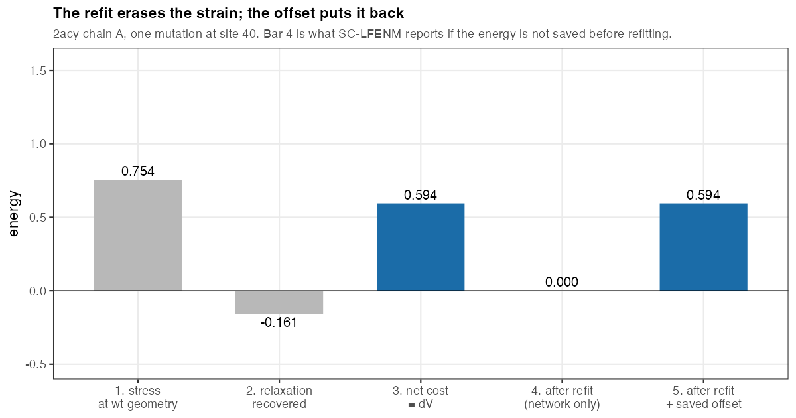
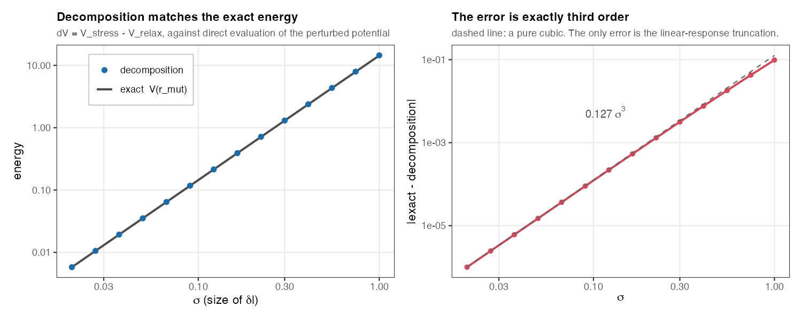
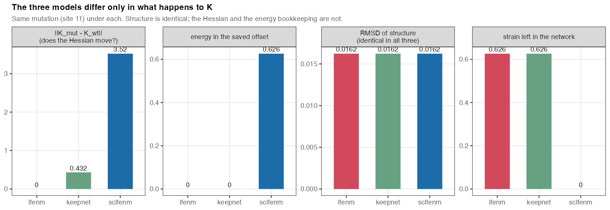
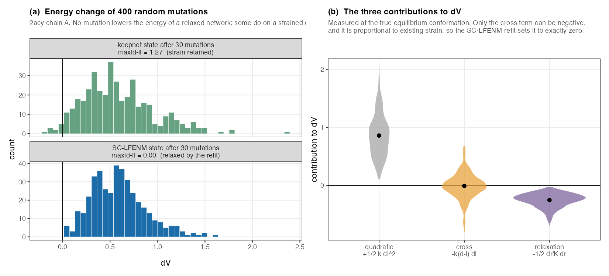
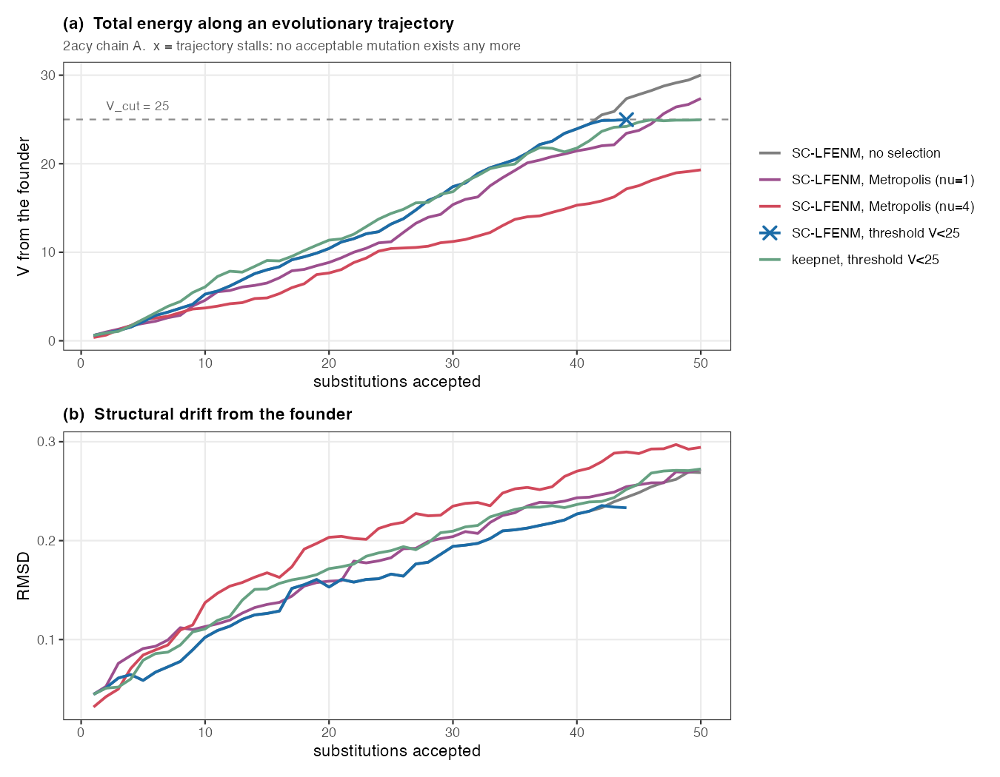
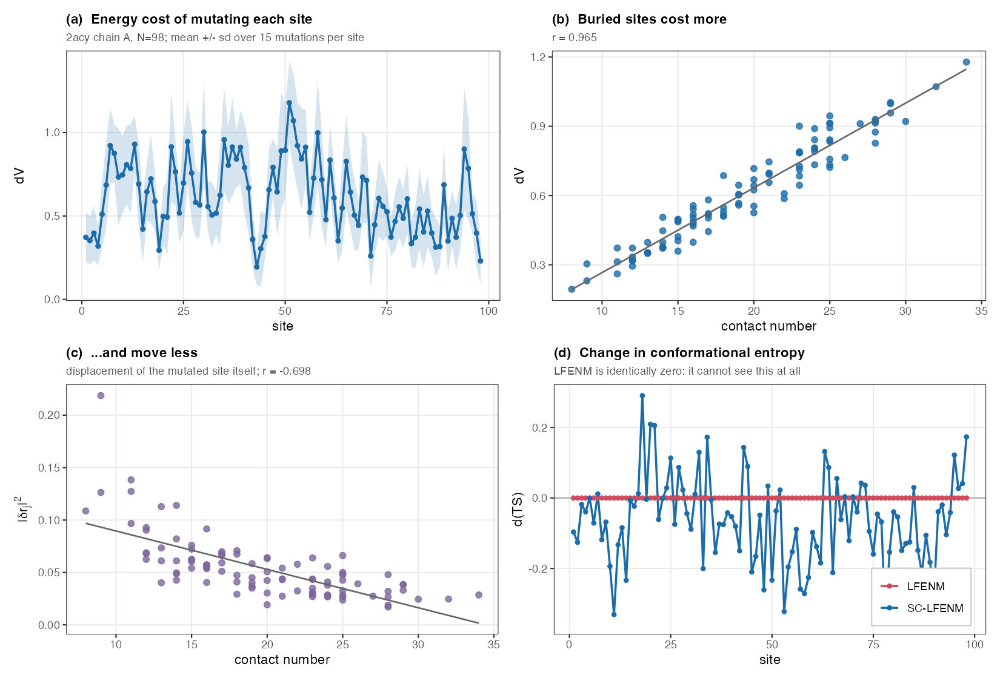
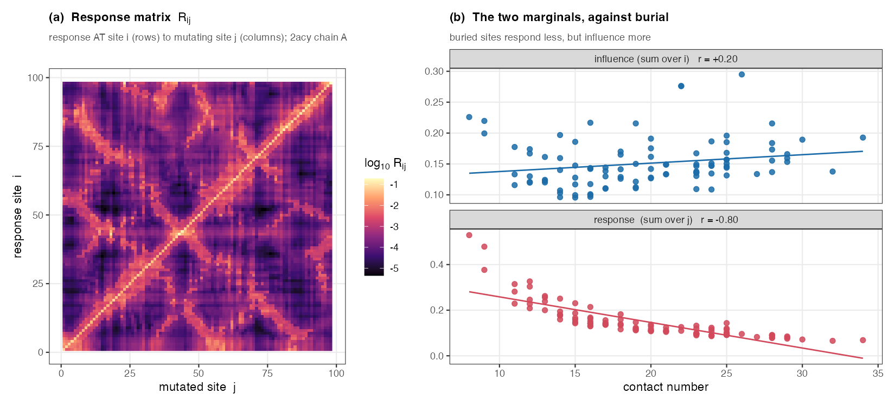
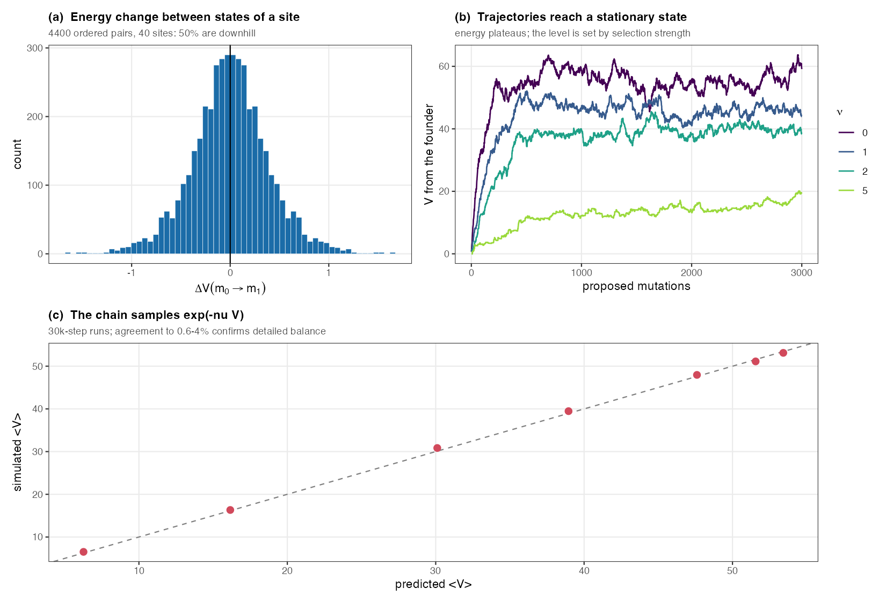
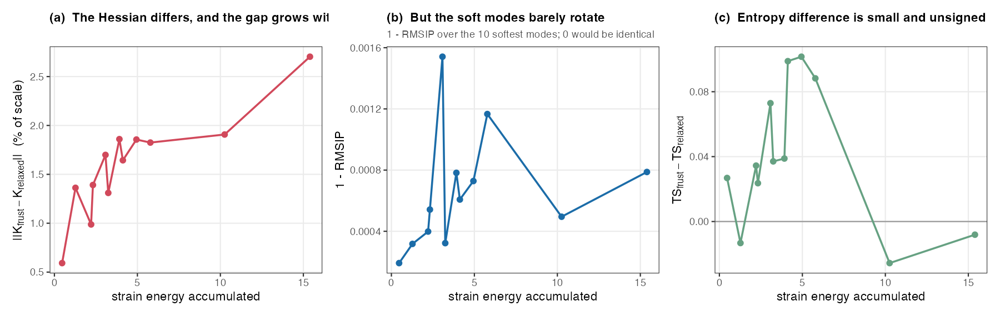

# SC-LFENM with energy bookkeeping

Scratch work, 2026-08-21. Nothing here is tracked, and nothing touches the
`penm` package — it is a standalone testbed built to answer one question.

---

## The question

You proposed this:

> ENMs fit a network to a structure — given the native structure, they build
> completely relaxed springs, $l_{ij} = d^e_{ij}$. So it is consistent to
> *rebuild* the mutant's network once its structure is known. But if I do that,
> I think I need to save the effect of the pre-built stress terms in order to
> calculate the mutant's energy.

I set out to check whether the saving is really needed, what exactly has to be
saved, and whether the resulting model works for the two things you want to do
with it: **single-mutation scanning** and **evolutionary trajectories**.

Call the model **SC-LFENM** (self-consistent LFENM): mutate the natural lengths
as in LFENM, relax, then *rebuild* a fully relaxed network on the relaxed
structure, and repeat.

**What I found.**

1. **The saving is needed**, and what must be saved is one scalar per state
   (§§2–3). The rebuild erases the strain, so a mutation that genuinely costs
   0.6 energy units is otherwise reported as costing zero.
2. **For scanning, SC-LFENM works well** (§7) and gives what LFENM cannot: a
   changed spectrum, hence mutational effects on dynamics.
3. **The obvious way of running a trajectory fails** (§6), and for a structural
   reason: re-fitting the network at every step makes the current state the zero
   of energy, so every move is uphill and the walk is absorbing. No amount of
   tuning selection repairs it.
4. **Your catalogue fixes it** (§8). Reference every mutation to the *founder*
   rather than to the current state. The energy then has a fixed floor and the
   state space is finite, so trajectories reach a genuine stationary state
   instead of stalling. The bookkeeping is exactly reversible and $\Delta V$
   takes both signs. The price is a surrogate energy, additive over sites:
   accurate to ~2 % in aggregate, but with per-move errors that can flip a sign,
   and degrading with distance from the founder, so the catalogue needs periodic
   rebuilding.
5. **Frustration** is created by every mutation and changes the Hessian by
   0.6–2.7 %, but rotates the soft modes by less than 0.2 % (§9).
6. **$\mathbf K_{wt}$ vs $\mathbf K_{mut}$** for the response — open since 2020 —
   is settled: the direction agrees to cos > 0.994, only the magnitude differs
   (§10).

**Notation.** $\beta = 1/kT$ is Boltzmann's, used only for thermodynamic
quantities. Selection strength is written $\nu$, a separate letter, because it is
an evolutionary parameter and not a temperature.

---

## 1. Setting up: the potential, and three Hamiltonians

### The potential

An elastic network model assigns to a conformation $\mathbf r$ the energy

$$V(\mathbf r \,;\, \{l_{ij}\}) \;=\; \sum_{i<j} \Big[\, V^{\min}_{ij} \;+\; \tfrac12\, k_{ij}\,\big(d_{ij}(\mathbf r) - l_{ij}\big)^{2} \,\Big]
\tag{1}$$

where $d_{ij}(\mathbf r) = \lVert \mathbf r_j - \mathbf r_i\rVert$ is the
distance in the conformation $\mathbf r$, $k_{ij}$ the force constant, and
$l_{ij}$ the natural (rest) length of the spring $i\leftrightarrow j$. Sums run
over the contact set. Throughout I take $V^{\min}_{ij} = 0$ and keep the
constant separately (§3).

Two arguments, and they play different roles. **$\mathbf r$ is a variable** — it
ranges over conformations. **$\{l_{ij}\}$ are parameters** — fixing them fixes
the Hamiltonian. Changing $\{l_{ij}\}$ does not move the protein; it replaces
the potential by a different one.

### The three Hamiltonians

Write $V_X(\mathbf r) \equiv V(\mathbf r; \{l^X_{ij}\})$ for the potential with
parameter set $X$. Three appear, and everything below turns on keeping them
apart:

$$V_{\text{wt}}(\mathbf r) \;=\; \tfrac12\sum_{i<j} k_{ij}\big(d_{ij}(\mathbf r) - l_{ij}\big)^{2}
\tag{2}$$

$$V_{\text{mut}}(\mathbf r) \;=\; \tfrac12\sum_{i<j} k_{ij}\big(d_{ij}(\mathbf r) - l_{ij} - \delta l_{ij}\big)^{2}
\tag{3}$$

$$V_{\text{ref}}(\mathbf r) \;=\; \tfrac12\sum_{i<j} k_{ij}\big(d_{ij}(\mathbf r) - d_{ij}(\mathbf r^{e}_{\text{mut}})\big)^{2}
\tag{4}$$

- **(2) the wild type**, springs $l_{ij}$.
- **(3) the LFENM mutant**: the mutation perturbs the natural lengths,
  $l_{ij} \to l_{ij} + \delta l_{ij}$, on the contacts of the mutated site.
  Nothing else changes. This Hamiltonian **keeps the strain**.
- **(4) the refit**: a *new* network built on the mutant's equilibrium
  conformation, with its springs reset to the distances found there. This is
  what "an ENM is a fit to a structure" produces, and it is the object SC-LFENM
  diagonalises.

For each, the associated quantities:

| symbol | meaning |
|---|---|
| $\mathbf F_X(\mathbf r) = -\partial V_X/\partial\mathbf r$ | the force |
| $\mathbf r^{e}_X$ | the **equilibrium conformation**: where $\mathbf F_X(\mathbf r^{e}_X) = \mathbf 0$ |
| $V^{\min}_X \equiv V_X(\mathbf r^{e}_X)$ | the **minimum energy** — a number, not a function |
| $\mathbf e_{ij}$ | unit vector along the contact, $(\mathbf r_j - \mathbf r_i)/d_{ij}$ |
| $\mathbf K_X$ | the Hessian of $V_X$ at $\mathbf r^{e}_X$; its null space is the six rigid-body motions |
| $\mathbf C_X = \mathbf K_X^{+}$ | the covariance — Moore–Penrose pseudo-inverse of $\mathbf K_X$, inverting it on its range |

### The wild type is relaxed by construction

The ENM fit chooses $l_{ij} = d_{ij}(\mathbf r^{e}_{\text{wt}})$ — every spring
sits at its natural length in the native structure. Three consequences, used
constantly below and all verified numerically:

$$\mathbf F_{\text{wt}}(\mathbf r^{e}_{\text{wt}}) = \mathbf 0, \qquad V^{\min}_{\text{wt}} = 0, \qquad d_{ij}(\mathbf r^{e}_{\text{wt}}) - l_{ij} = 0 \ \ \forall\, ij$$

The third is the one that matters most: **the wild type carries no strain**, and
that is exactly what makes the cross term of §6 vanish.

**The system.** All numbers below are for acylphosphatase, 2acy chain A: 98
residues, 960 contacts at $d_{\max} = 10.5$ Å, uniform $k_{ij} = 1$ (ANM), and
mutation size $\sigma = 0.3$ unless stated otherwise. This is the structure every
`penm` fixture is built from. Note that mutations perturb **every** contact of
the mutated site — `mut_sd_min = 1`, not penm's default of 2, which excludes
backbone neighbours.

## 2. The energy of a mutation

**Step 1 — stress.** Put $\mathbf r = \mathbf r^{e}_{\text{wt}}$ into the mutant
Hamiltonian (3). Because the wild type is relaxed,
$d_{ij}(\mathbf r^{e}_{\text{wt}}) = l_{ij}$ exactly, so the bracket collapses:

$$V_{\text{mut}}(\mathbf r^{e}_{\text{wt}}) \;=\; \tfrac12\sum_{i<j} k_{ij}\big(l_{ij} - l_{ij} - \delta l_{ij}\big)^{2} \;=\; \tfrac12\sum_{i<j} k_{ij}\,\delta l_{ij}^{2} \;\equiv\; V_{\text{stress}}$$

**Step 2 — the induced force.** At that same conformation the mutant Hamiltonian
is no longer at equilibrium; it exerts

$$\mathbf f \;\equiv\; \mathbf F_{\text{mut}}(\mathbf r^{e}_{\text{wt}}) \;=\; -\frac{\partial V_{\text{mut}}}{\partial \mathbf r}\bigg|_{\mathbf r^{e}_{\text{wt}}}$$

Contact $ij$ contributes a pair of equal and opposite forces of magnitude
$k_{ij}\,\delta l_{ij}$ along $\mathbf e_{ij}$; the force on node $i$, written
$\mathbf f_i$, is the sum over its contacts, and $\mathbf f$ stacks those $N$
three-vectors.

Because these are central pair forces, $\sum_i \mathbf f_i = \mathbf 0$ **and**
the net torque about the centroid vanishes. That matters because $\mathbf K$'s
null space is exactly the six rigid-body motions: a force with neither net force
nor net torque is orthogonal to that null space, hence lies in the range of
$\mathbf K$, and so $\mathbf C_{\text{wt}}\mathbf f$ is the true solution of
$\mathbf K\,\delta\mathbf r = \mathbf f$ rather than the least-squares projection
of an unsolvable system. Both checked numerically.

**Step 3 — relaxation.** To linear order the mutant's equilibrium conformation is

$$\mathbf r^{e}_{\text{mut}} \;\simeq\; \mathbf r^{e}_{\text{wt}} + \delta\mathbf r, \qquad \delta\mathbf r = \mathbf C_{\text{wt}}\,\mathbf f$$

This is an *approximation*: the true $\mathbf r^{e}_{\text{mut}}$ satisfies
$\mathbf F_{\text{mut}} = \mathbf 0$, and the linear-response estimate leaves a
residual force of order $\delta l^{2}$ (measured on 2acy: $|\mathbf F| = 2.1
\times 10^{-2}$, removed to $10^{-10}$ in 8 Newton iterations, moving the
structure by $4\times10^{-3}$ Å).

**Step 4 — the energy change.** The quantity of interest is the difference of
*minimum* energies:

$$\boxed{\;\Delta V \;=\; V^{\min}_{\text{mut}} - V^{\min}_{\text{wt}} \;=\; V_{\text{mut}}(\mathbf r^{e}_{\text{mut}})\;}$$

and expanding about $\mathbf r^{e}_{\text{wt}}$ gives the two-term form,

$$\Delta V \;=\; \underbrace{\tfrac12\sum k_{ij}\,\delta l_{ij}^{2}}_{V_{\text{stress}}} \;-\; \underbrace{\tfrac12\,\delta\mathbf r^{T}\mathbf K_{\text{wt}}\,\delta\mathbf r}_{V_{\text{relax}}} \;+\; O(\delta l^{3})$$

On 2acy, site 40: $V_{\text{stress}} = 0.7544$ and $V_{\text{relax}} = 0.1609$, so
the decomposition gives $\Delta V = 0.5935$. Evaluating $V_{\text{mut}}$ directly at
the true minimum gives $0.5941$ — a gap of $0.1\,\%$, which is the $O(\delta l^{3})$
truncation. **$V^{\min}_{\text{mut}}$ is emphatically not zero**: the mutant
Hamiltonian keeps both the stress and the relaxation terms, exactly as in your
`sc_lfenm.md`.

## 3. What the refit does, and why the energy must be saved

Now refit: build a *new* network on $\mathbf r^{e}_{\text{mut}}$, with springs
$l_{ij} = d^{e}_{ij}(\mathbf r^{e}_{\text{mut}})$. That is $H_{\text{ref}}$, and
because its springs are relaxed by construction,

$$V^{\min}_{\text{ref}} \;=\; 0 \qquad\text{while}\qquad V^{\min}_{\text{mut}} \;=\; 0.594$$

**Two different Hamiltonians share the structure $\mathbf r^{e}_{\text{mut}}$ and
disagree about its energy.** That gap is precisely the strain the refit threw
away, and it is what has to be carried forward. (It is tempting to write
$V_{\text{mut}}(\mathbf r^{e}_{\text{mut}}) = 0$ here. That is wrong: it attaches
the refit Hamiltonian's energy to the mutant Hamiltonian's symbol, and collapses
the whole distinction.)

**How to read this.** One mutation on 2acy. Bars 1 and 2 are $V_{\text{stress}}$
and $-V_{\text{relax}}$; bar 3 their sum, the true $\Delta V$. Bar 4 is
$V^{\min}_{\text{ref}}$ — what you get if you refit and then read the energy off
the new network. Bar 5 restores the right answer by carrying the gap.

So each state stores a scalar **offset** `v_off`, and its energy is

$$V^{\min}(\text{state}) \;=\; \underbrace{\tfrac12\sum_{i<j} k_{ij}\big(d^{e}_{ij}-l_{ij}\big)^{2}}_{\text{strain the network still carries}} \;+\; \texttt{v\_off}$$

$0$ for the founder, correct for every descendant, and verified: refit energy
plus offset reproduces $V^{\min}_{\text{mut}}$ to machine precision. The offset
is a constant — it never enters forces or $\mathbf K$ — so it is free
dynamically. It is exactly the $V^{\min}_{ij}$ slot of your 2017 equation (1),
which the current LFENM sets to zero and never uses.

**One caveat on $\mathbf r^{e}$ in the code.** A state stores one structure. For
a refit state that structure *is* $\mathbf r^{e}$ exactly. For the non-refit
models it is the linear-response estimate, carrying an $O(\delta l^{2})$
residual force; `state_vmin(st, exact = TRUE)` relaxes to the true minimum first
and is the default in `run_trajectory()`.

Every step above is checked numerically in `derivation.R`, which walks the
derivation in order on 2acy site 40 — wild-type relaxedness, the stress energy,
the force sum and torque, $\mathbf K\,\delta\mathbf r = \mathbf f$, the Newton
relaxation, the two-term identity, and finally
$V^{\min}_{\text{ref}} + \texttt{v\_off} = V^{\min}_{\text{mut}}$ — printing
OK or DIFF for each of its 11 assertions. All pass.

---

## 4. The two-term formula is exact to $O(\delta l^{3})$

$V_{\text{stress}} - V_{\text{relax}}$ is a quadratic approximation. Comparing it
against direct evaluation of the perturbed potential at the relaxed mutant
structure, over a 50-fold range of mutation sizes:

**Left:** the decomposition and the exact energy over a 50-fold range in
$\sigma$; both scale as $\sigma^{2}$ and the points sit on the line.
**Right:** the discrepancy, on log axes, against a pure cubic (dashed). Fitted
slope 2.95. The error is $O(\delta l^{3})$, which is the linear-response
truncation and nothing else; the bookkeeping itself is exact. At a realistic
$\sigma = 0.3$ the error is $0.11\,\%$ at site 40 and $0.72\,\%$ at site 11 —
it is site-dependent, so a single figure is not meaningful on its own.

Mutating site A then site B gives the same accumulated energy as B then A, to
$6\times10^{-4}$ — the same order as the truncation error. Note the scope: that
test (`test_path_rebuild.R`) is on a synthetic 40-node helix, and its companion
`test_path.R` covers the *non-rebuild* scheme, not SC-LFENM. Path-independence on
2acy under the rebuild is not established here.

---

## 5. Three models: `lfenm`, `keepnet`, `sclfenm`

"Rebuild or not" is not a single choice: there are three distinct models, and two
of them are easy to confuse. They differ *only* in what happens to the Hessian
$\mathbf K$.

| | what happens to the network | what happens to $\mathbf K$ | modes change? |
|---|---|---|---|
| **lfenm** | kept; $l$ accumulates | **frozen** at the wild type | never |
| **keepnet** | kept; $l$ accumulates | recomputed at the new structure | yes, through geometry |
| **sclfenm** | **rebuilt** relaxed | rebuilt | yes, geometry + contact map |

The rebuilt contact map really does differ, and by an amount that depends on the
site: mutating site 40 takes 2acy from 960 contacts to 965, while the site-11
mutation of figure 6 adds 3. Wild-type and mutant are therefore networks over
different edge sets, which is why sums over contacts need care when comparing
them.

The middle one is the trap. "Don't rebuild the contact list" does *not* mean
"freeze $\mathbf K$": even with the same contacts, $\mathbf K$ drifts because
the unit vectors $\mathbf e_{ij}$ and distances $d_{ij}$ have moved. Textbook
LFENM freezes $\mathbf K$ outright. The distinction is worth holding onto: the
three give different answers for anything involving motion.

Figure 6 uses a mutation at site 11, so its energies are not the site-40 numbers
of §§2–3. Note that **the structure is identical in all three** (second panel). All three relax with $\mathbf C_{\text{wt}}$; the difference appears
only afterwards. And in the last two panels you can see the energy physically
move out of the network and into the offset when you rebuild.

---

## 6. Re-referencing at every step makes the walk absorbing

This section diagnoses why the obvious way of running a trajectory fails. §8
gives the cure, so read the two together: the failure is real, but it is a
consequence of *re-referencing*, not of SC-LFENM as such.

**Under SC-LFENM, every mutation raises the energy. Without exception.** In 400
random mutations from the wild type the smallest $\Delta V$ was $+0.055$; from a
state already 30 substitutions along, $+0.023$ over 400 draws
(`fig3_dv_positive.R`). Not one was negative.

**Panel (a)** shows the distribution of $\Delta V$ for 400 random mutations,
starting from two states each 30 substitutions from the founder: a rebuilt
SC-LFENM state (bottom, exactly relaxed, $\min\Delta V = +0.023$) and a `keepnet`
state carrying strain (top, $\min\Delta V = -0.188$, 2 % of draws negative). The
strained state has a tail crossing zero; the relaxed one does not come near it.

### Why every mutation costs energy

**A proof, not a demonstration.** Let $\mathbf B$ be the $3N \times n_{\text{edge}}$
matrix whose column for contact $ij$ holds $+\mathbf e_{ij}$ in node $i$'s three
rows and $-\mathbf e_{ij}$ in node $j$'s — the incidence matrix weighted by
contact directions — so that Step 2's force is $\mathbf f = -\mathbf B\,(k\,\delta\mathbf l)$.
Define the weighted perturbation $\mathbf u = \sqrt{k}\,\delta\mathbf l$, one entry
per contact. Then

$$V_{\text{stress}} = \tfrac12\lVert\mathbf u\rVert^{2}, \qquad V_{\text{relax}} = \tfrac12\,\mathbf u^{T}\mathbf M\,\mathbf u, \qquad \mathbf M \equiv \sqrt{k}\,\mathbf B^{T}\mathbf C\,\mathbf B\sqrt{k}$$

— the first from Step 1, the second by substituting $\delta\mathbf r = \mathbf C\mathbf f$
into $\tfrac12\,\delta\mathbf r^{T}\mathbf K\,\delta\mathbf r$ and using
$\mathbf C\mathbf K\mathbf C = \mathbf C$.

**This is where relaxedness enters.** The projector property depends on
$\mathbf K = \mathbf B\,\mathrm{diag}(k)\,\mathbf B^{T}$, which holds *only*
when every $g_{ij} = 0$ — that is, only for a relaxed network. Measured: on the
relaxed wild type $\max\lvert\mathbf K - \mathbf B k\mathbf B^{T}\rvert = 0$
exactly; on a frustrated state it fails by $0.23$ against a scale of $12.9$. So
"$\Delta V \ge 0$ for any relaxed network" is not a rhetorical qualifier — the
identity underpinning the proof is exactly what relaxedness buys.

**$\mathbf M$ is an orthogonal projector.** Verified on 2acy:
$\max\lvert\mathbf M^{2}-\mathbf M\rvert = 1.1\times10^{-14}$, every eigenvalue in
$\{0,1\}$, rank exactly $288 = 3N-6$ — one unit eigenvalue per internal degree of
freedom, since $\mathbf M$'s range is the image of the non-rigid directions. A
projector satisfies $\mathbf u^{T}\mathbf M\mathbf u \le \lVert\mathbf u\rVert^{2}$
for every $\mathbf u$, so

$$V_{\text{relax}} \;\le\; V_{\text{stress}} \qquad\Longrightarrow\qquad \Delta V \;\ge\; 0$$

with equality only when $\mathbf u$ lies entirely in the range of $\mathbf M$ —
i.e. when the perturbation is fully absorbable by relaxation. Relaxation recovers
at most the stress it was given, and the "at most" is a projection, not an
inequality that needs checking.

**This holds for any relaxed network** — any structure, any cutoff — and is not
special to the SC-LFENM refit. The refit merely guarantees relaxedness at every
step. (`proof_projector.R` builds $\mathbf M$ explicitly, checks $\mathbf M^2 = \mathbf M$
and its spectrum, then confirms $V_{\text{relax}} \le V_{\text{stress}}$ on 200
random single-site mutations.)

### What strain buys

On a network that is *not* relaxed, expanding about its equilibrium conformation
gives a third term:

$$\Delta V \;=\; \underbrace{\tfrac12\sum k\,\delta l^{2}}_{>0,\;O(\sigma^{2})}\;\underbrace{-\;\sum k\,(d^{e}_{ij}-l_{ij})\,\delta l}_{\text{zero mean},\;O(\sigma)}\;\underbrace{-\;\tfrac12\delta\mathbf r^{T}\mathbf K\delta\mathbf r}_{<0}$$

The cross term is proportional to the existing strain, and it is the only one
that can be negative. The refit sets $d^{e}_{ij} = l_{ij}$ exactly, so under
SC-LFENM it vanishes identically and $\Delta V > 0$ strictly.

Panel (b) of figure 3 shows the three contributions over 400 mutations of a
strained `keepnet` state: the quadratic term always positive, the relaxation term
always negative, and the cross term straddling zero with its mean on it.

**The cross term has zero mean, so it adds variance, not drift.** Worth stating
plainly, because the natural reading — that strain gives `keepnet` access to
strain-relieving mutations, lowering the energy on average — is wrong. Measured
along a `keepnet` trajectory (`check_negative.R`, which walks 40 `keepnet`
substitutions and at selected steps relaxes the state, measures its accumulated
strain, then draws 250 fresh mutations from it):

| substitutions | strain | mean $\Delta V$ | min $\Delta V$ | fraction $<0$ |
|---|---|---|---|---|
| 5 | 2.7 | +0.620 | −0.079 | **0.008** |
| 20 | 15.6 | +0.632 | −0.464 | 0.040 |
| 40 | 73.8 | +0.649 | −1.597 | **0.104** |

The mean $\Delta V$ *rises* as strain accumulates. What widens is the
distribution: from 0.8 % of mutations downhill at 5 substitutions to 10.4 % at
40. A strained network survives at an energy ceiling because its fatter left
tail keeps producing the rare acceptable move — not because it drifts downhill.

One caveat on the argument: the cross term has zero mean over *unconditioned*
$\delta l$ draws, by symmetry of the Gaussian. Along a selected trajectory the
draws are not unconditioned — acceptance prefers those making the cross term
negative — so the unconditional statement does not by itself license a claim
about a selected walk. The measured table above is the direct evidence, and it
agrees.

### What that does to a trajectory

**Panel (a):** energy accumulated from the founder, for five ways of running the
same model. Grey is no selection at all. Purple and red are Metropolis on the
step energy at two selection strengths — they *slow* the climb (slope $0.63$
unselected, $0.56$ at $\nu=1$, $0.39$ at $\nu=4$) but cannot stop it, because
there is no downhill move to find; even at $\nu = 4$, with 15 % of mutations
accepted, the energy still rises steadily.

The two lines at the bottom are the interesting ones. Both impose a hard ceiling
$V < 25$, which is what a stability criterion means when every step costs energy.
Blue is SC-LFENM: it climbs to the ceiling and **stalls** at 44 substitutions
(the ×) — no acceptable mutation exists any more, and the trajectory stops.
Green is `keepnet` under the identical criterion, and it does not stall.

**A comparison the figure alone does not license.** Running `keepnet` out to 70
substitutions separates two regimes (`check_steady.R`, which repeats the ceiling
run for 70 steps and reports mean energy, acceptance and drift in blocks of 20):

| block | mean $V$ | tries per acceptance | RMSD |
|---|---|---|---|
| steps 1–20 | 6.1 | 1.0 | 0.114 |
| steps 21–40 | 17.4 | 1.0 | 0.210 |
| steps 41–60 | 24.7 | 9.0 | 0.269 |
| steps 61–70 | 24.9 | 13.5 | 0.310 |

For the first 40 substitutions acceptance is *free* — the walk is nowhere near
the ceiling, and nothing is being tested. Only from step ~45 does the constraint
bind. So a whole-run acceptance rate mixes unconstrained and constrained steps and is
not comparable with a rate measured at the wall. The like-for-like figures are

$$\text{keepnet at steady state: } 0.123 \qquad\text{vs}\qquad \text{SC-LFENM at its stall: } 0.047$$

a factor of $2.6$. The qualitative conclusion holds — `keepnet` reaches a steady
state at the ceiling and keeps evolving (RMSD still climbing, $0.27 \to 0.31$,
while $V$ sits at $24.9$), whereas SC-LFENM stops altogether — but the margin is
a factor of two, not an order of magnitude, and it comes from the fatter left
tail of the strained $\Delta V$ distribution, not from downhill drift.

Panel (b) of figure 4 plots RMSD from the founder for the same five runs. The
blue SC-LFENM line simply ends at 44 substitutions; every other run keeps
drifting, and the green one keeps drifting at constant energy — which is what a
stationary evolutionary process should look like.

| run | substitutions reached | outcome |
|---|---|---|
| SC-LFENM, no selection | 50/50 | energy runs away |
| SC-LFENM, Metropolis $\nu=1$ | 50/50 | energy runs away, slower |
| SC-LFENM, Metropolis $\nu=4$ | 50/50 | energy runs away, slower still |
| **SC-LFENM, ceiling $V<25$** | **44/50** | **stalls** |
| **keepnet, ceiling $V<25$** | **70/70** | stationary at the ceiling; still drifting structurally |

This is a consequence of the design, not a bug. If the network is refit to
relaxed at every step, the model has no memory of strain, and therefore no way
to release any.

---

## 7. Where SC-LFENM does work: scanning

For single-mutation scanning the problem above never arises, because every
mutant is measured against a *fixed* founder and nothing accumulates. Here the
rebuild is pure gain: it gives you the changed spectrum that LFENM cannot
produce at all.

Run on 2acy chain A (98 residues, 960 contacts at $d_{\max} = 10.5$ Å).

**(a)** Energy cost of mutating each site, averaged over 15 mutations, with
spread. **(b)** That cost against contact number: $r = 0.97$ — buried sites cost
more, the standard stability result, on a real structure. **(c)** How far the
mutated site itself moves, against contact number: $r = -0.70$ — buried sites
move less, as they must, being held by more springs. **(d)** The change in
conformational entropy: identically zero under LFENM, which cannot see it at
all; range $[-0.35,\,+0.29]$ under SC-LFENM.

### Response and influence are different things

The natural object is the **response matrix**

$$R_{ij} \;=\; \big\langle\, \lvert \delta\mathbf r_i \rvert^{2} \,\big\rangle \qquad \text{averaged over mutations at site } j$$

— the response *at* site $i$ to mutating site $j$.

Panel (a) is the matrix itself on a log scale: a bright diagonal (a site responds
most to its own mutation), bands along the contacts, and off-diagonal ridges
where sequence-distant segments are in spatial contact. Panel (b) shows the two
marginals against burial.

It has two marginals, and they answer different questions:

| marginal | name | meaning | vs contact number |
|---|---|---|---|
| $\sum_j R_{ij}$ | **response** of site $i$ | how much $i$ moves when the protein is mutated anywhere | $r = -0.80$ |
| $\sum_i R_{ij}$ | **influence** of site $j$ | how much the protein moves when $j$ is mutated | $r = +0.20$ |

Both computed analytically (no sampling) in `response_influence.R`; the two
marginals sum to the same total, $14.777$, checked three ways.

They point opposite ways and both are right. A buried site is held by more
springs, so it **responds** less. But mutating a buried site forces all of its
many contacts, so it **influences** more. The diagonal $R_{jj}$ — how far the
mutated site itself moves — follows the *response* correlation, not the influence
one: figure 5(c) plots it against contact number and gives $r = -0.70$.

The two marginals are easy to confuse, and confusing them inverts the sign. An
independent check settles which is which, using no mutation at all: equilibrium
mean-square fluctuation against contact number gives $r = -0.80$, matching the
*response* marginal exactly. Buried sites fluctuate less; buried sites respond
less; these are the same statement.

**$R$ is not symmetric**, and should not be. `prs_theory.md` notes that the
single-edge response matrix is symmetric — stretching one spring is one spring's
worth of perturbation however you label its ends. But a *site* mutation forces
all $cn_j$ contacts of $j$, so column sums scale with contact number while row
sums do not: measured asymmetry $\max\lvert R - R^{T}\rvert / \max R = 0.49$,
identical in the analytical and simulated matrices, so it is structural rather
than sampling noise.

---

## 8. Trajectories made stationary: the catalogue model

§6 showed that re-referencing the network at every step makes every mutation
uphill, so the walk is absorbing. **The fix is not to re-reference.** It is
yours, and it works.

### The idea

Keep one fixed reference — the founder. For each site $j$, catalogue a set of
alternative states $m = 0, 1, \ldots, M$, where $m = 0$ means "not mutated" (this
is already penm's convention: `mutation = 0` returns the wild type unchanged).
For each, record the change *relative to the founder*:

$$X(0 \to j,m) \qquad\text{for } X \in \{\Delta V,\; \delta\mathbf r,\; \Delta(TS),\; \ldots\}$$

A move between two states of the same site is then a **difference of catalogued
quantities**:

$$X(j, m_0 \to m_1) \;=\; X(0 \to j, m_1) \;-\; X(0 \to j, m_0)$$

**Be precise about what this is and is not.** As algebra on one site's stored
values it is a triviality — $X_{m_1}-X_{m_0}=(X_{m_1}-X_0)-(X_{m_0}-X_0)$. It is
exact for the physical energy **only when the rest of the protein is in the state
the catalogue was built against**, i.e. the founder. Used mid-trajectory, when
other sites have already mutated, it inherits a site-additivity approximation
(quantified below). So the identity defines a *surrogate* energy

$$V_{\text{cat}}(\mathbf s) \;=\; \sum_j \Delta V(0 \to j, s_j)$$

and the trajectory is exact **in $V_{\text{cat}}$**, approximate in $V$.

That distinction granted, three consequences follow, and they are what make the
scheme work:

1. **The bookkeeping is exactly antisymmetric**: $X(m_1\to m_0) = -X(m_0\to m_1)$
   in $V_{\text{cat}}$, so the walk is reversible by construction. This is a
   property of the ledger, not a claim about the physical energy — but it is the
   property a Markov chain needs.
2. **$\Delta V_{\text{cat}}$ takes both signs** — negative whenever $m_1$ is a
   cheaper state of that site than $m_0$. (Quoting "50 % of *ordered* pairs are
   downhill" would be a tautology, forced by antisymmetry. The informative
   statement: over 450 unordered pairs at 30 sites the median $\lvert\Delta V\rvert$
   is $0.16$ and the maximum $1.01$, so a downhill direction exists for
   essentially every pair of states.)
3. **The state space is finite and the energy has a floor.** $(M+1)^N$ sequences,
   and every catalogue entry is $\ge 0$ (measured range $[0,\,1.647]$), so
   $V_{\text{cat}} \ge 0$ with the founder at the bottom.

**Consequence 3 is the operative one**, and it is worth being explicit that §6's
theorem is not violated here but respected. §6 proves $\Delta V \ge 0$ for any
mutation measured from a *relaxed* network's own minimum. The founder is relaxed,
so every catalogue entry is indeed non-negative. What changed is that the
reference is now **fixed**: the floor stays at the founder instead of moving up
to meet the walker at every step. Downhill moves exist because a site can revert
toward a cheaper state — partially back toward the founder — not because any
single mutation from a relaxed reference has become negative.

### Two changes were made at once

The catalogue is built with **LFENM**, not SC-LFENM (`penm_catalog.R` uses
`mut_model = "lfenm"`). So §8 differs from §6 in two ways — a fixed reference
*and* a different model — and the cure should not be credited entirely to the
first. The fixed reference is what gives the finite state space and the floor;
LFENM is what makes the catalogue's structural entries background-independent
(§8, "The one assumption"). Both are needed.

### Why LFENM makes this exact

penm's `calculate_force()` computes $f_{ij} = -k_{ij}\,\delta l_{ij}$ *directly*
from the perturbation, and `calculate_dxyz()` returns
$\delta\mathbf r = \mathbf C_{\text{wt}}\mathbf f$. That is the linearisation the
name "linearly forced" refers to: expand to first order in $\delta l$, and the
mutation becomes an external force on the unchanged wild-type network.

Because $\delta\mathbf r$ is *linear* in $\mathbf f$, a trajectory
$\mathbf f_1, \mathbf f_2, \ldots$ gives

$$\delta\mathbf r_{\text{total}} \;=\; \mathbf C\Big(\textstyle\sum_i \mathbf f_i\Big) \;=\; \sum_i \mathbf C\mathbf f_i \;=\; \sum_i \delta\mathbf r_i$$

Structure is **exactly additive**, and therefore exactly reversible. Verified on
2acy to machine precision:

| identity | measured |
|---|---|
| $\delta\mathbf r(\sum \mathbf f) = \sum \delta\mathbf r$ | $4.5\times10^{-15}$ |
| forward then exact reverse returns the founder | $\lvert\delta\mathbf r\rvert = 7.5\times10^{-17}$ |
| $\Delta V(1\to2) + \Delta V(2\to1) = 0$ | $0$ exactly |
| `mutation = 0` returns the wild type | identical |

### It works

**(a)** The distribution of $\Delta V$ between states of a site, over 4400
ordered pairs at 40 sites. It is symmetric about zero by antisymmetry, so the
50 % figure is forced; what the panel shows is the *spread* — median
$\lvert\Delta V\rvert = 0.16$, tails to $\pm 1.6$. Compare §6, where every
mutation from the current state was uphill and no downhill move existed at all.

**(b)** Trajectories under a Metropolis rule on the catalogue difference, at four
selection strengths. Every one reaches a stationary state: the energy climbs from
the founder, then plateaus and fluctuates about a stable mean. No stalling, no
runaway. The plateau level is set by selection.

**(c)** The equilibrium energy against the analytical prediction
$\langle V_{\text{cat}}\rangle = \sum_j \sum_m p_{jm}\,\Delta V_{jm}$ with
$p_{jm} \propto e^{-\nu\,\Delta V_{jm}}$. Agreement to 0.6–4 % over a 32-fold
range in $\nu$.

**What this does and does not show.** $V_{\text{cat}}$ is separable by
construction, and the proposal is symmetric, so a correct Metropolis sampler
*must* reach the product measure $\prod_j p_{jm}$ — panel (c) is a unit test of
the sampler, not evidence about the physics. It cannot fail if the code is right.

The question it does not answer is whether the *exact* energy of the sampled
sequences behaves the same way. Running the chain on $V_{\text{cat}}$ and then
evaluating the true $V$ of the sampled sequences:

| $\nu$ | predicted | $\langle V_{\text{cat}}\rangle$ | $\langle V_{\text{exact}}\rangle$ | difference |
|---|---|---|---|---|
| 1 | 47.6 | 48.5 | 49.5 | −2.2 % |
| 2 | 39.0 | 38.1 | 37.9 | +0.5 % |
| 5 | 16.2 | 14.1 | 14.2 | −1.1 % |

The surrogate tracks the exact energy to about 2 % in the mean
(`test_exact_boltzmann.R`), so the chain samples something close to
$e^{-\nu V}$ — but "close to", measured, not "provably".

Convergence is from both directions: starting at the founder ($V = 0$) the walk
rises to $\langle V\rangle = 36.4$; starting from a random sequence
($V = 61.8$) it falls to $34.9$. Same level from above and below.

### The one assumption, and how it degrades

The difference identity is exact within $V_{\text{cat}}$. What is *assumed* is
that a site's states have **background-independent** effects: the catalogue is
built against the founder but used when other sites have already mutated.

Measured on one protocol for both models — take eight fixed perturbations of site
40, apply them to backgrounds evolved 5 to 40 substitutions away, and compare
against their effect on the founder (`test_background_final.R`):

| substitutions | $\operatorname{cor}(\Delta V)$ | $\Delta V$ error | $\lvert\delta\mathbf r\rvert$ error |
|---|---|---|---|
| 5 | 0.968 | 9.2 % | **0.66 %** |
| 10 | 0.876 | 19.8 % | 6.3 % |
| 20 | 0.868 | 21.7 % | 8.7 % |
| 40 | 0.607 | 48.0 % | 17.3 % |

**The error does grow.** An earlier measurement suggested otherwise; it ran to
only 20 substitutions on a different protocol. The structural response is very
good early (0.66 % at 5 substitutions, as the linearity argument predicts, since
$\mathbf C$ is frozen) but degrades as the accumulated $\delta\mathbf l$ moves the
geometry away from the founder. So a catalogue built once against the founder is
reliable for tens of substitutions, not hundreds, and for long trajectories it
should be **rebuilt periodically** against the current state.

The energy error is *entirely* the cross term of §6: correlation between the
background-dependence of $\Delta V$ and the computed cross term is $0.9999$,
residual $\sim10^{-3}$ (`test_background3.R`). Since the cross term is computable
from the current state's strain, it can be corrected for — the cheapest way to
extend the catalogue's useful range.

**SC-LFENM cannot be catalogued at all.** The rebuild changes the contact set
(960 $\to$ 959 edges after five substitutions), so a $\delta\mathbf l$ vector built on
the founder no longer matches the mutant's graph; the operation is not merely
inaccurate but undefined. This is a stronger reason to use LFENM for the
catalogue than the error magnitudes.

### A second assumption: additivity across sites

The catalogue energy of a sequence sums single-site contributions,
$V(\mathbf s) = \sum_j \Delta V(0 \to j, s_j)$. This is a *different*
approximation from the difference identity — that one is exact; this one assumes
mutations at different sites do not interact. Measured against the exact energy
of the combined perturbation:

| sites mutated | catalogue | exact | relative error |
|---|---|---|---|
| 1 | 0.752 | 0.752 | 0.0 % |
| 5 | 3.060 | 3.022 | 1.2 % |
| 20 | 11.61 | 11.85 | −2.2 % |
| 98 (all) | 60.66 | 61.38 | −1.1 % |

Within about 2 % even when every site is mutated, and not growing systematically
with the number of sites (`test_site_additivity.R`).

**Per move the error is much larger, and can flip a sign.** Aggregate agreement
hides it. On a background with 30 sites mutated, comparing the catalogue's
$\Delta V$ for a single move against the exact value
(`test_catalog_honest.R`, 12 moves):

| site | move | catalogue | exact | error |
|---|---|---|---|---|
| 33 | 10 $\to$ 8 | −0.401 | −0.426 | 0.025 |
| 14 | 8 $\to$ 9 | −0.040 | −0.155 | 0.116 |
| **31** | **5 $\to$ 4** | **+0.232** | **−0.048** | **0.280** |
| 23 | 1 $\to$ 10 | +0.136 | +0.015 | 0.122 |

One move in twelve had the **wrong sign** — the catalogue called it uphill when
it was in fact downhill. So the chain is making some accept/reject decisions on
the wrong side of zero. The aggregate energy is still tracked to 2 %, because
these errors are unbiased and average out, but a study that cared about
*individual* substitutions rather than ensemble properties would need the exact
$\Delta V$ at each step.

---

## 9. With and without frustration

A network is **frustrated** when $l_{ij} \neq d^{e}_{ij}$: its springs are
stressed at the equilibrium conformation. The word covers two separate questions,
and conflating them causes most of the confusion around the `frustrated` flag.

**(A) Does the model let a network be frustrated?** — a question about $\{l_{ij}\}$.
**(B) Does the Hessian keep the transverse term?** — a question about $\mathbf K$.

### The wild type is never frustrated

`set_enm()` fits $l_{ij} = d_{ij}$, so on any freshly built network
$\max\lvert l - d\rvert = 0$ exactly and the flag is a strict no-op:
$\lVert\mathbf K_{\text{frust}} - \mathbf K_{\text{relaxed}}\rVert = 0$. This is
why `frustrated = FALSE` costs nothing for a wild type, and why the blocked
`stopifnot(!frustrated)` has never been felt.

### Mutation creates frustration

The moment a mutation is applied, $l_{ij} \to l_{ij} + \delta l_{ij}$ while the
structure relaxes only partially, so the two part company:

| substitutions | $\max\lvert l-d\rvert$ | strain energy |
|---|---|---|
| 1 | 0.58 | 0.65 |
| 3 | 0.64 | 1.59 |
| 6 | 1.02 | 2.82 |

So **every LFENM mutant is frustrated**, exactly as your 2017 document argues
("as we introduce mutations frustrations are introduced"). The question is
whether that frustration is allowed to reach the dynamics.

### A trap worth recording

The frustrated Hessian must be evaluated **at a stationary point**. The LFENM
structure is the linear-response estimate, not the true minimum — on a 10-mutation
state the residual force is $\lvert\mathbf F\rvert = 0.61$. A Hessian taken there
is not singular on rotations, and produces three spurious eigenvalues of order
$4\times10^{-4}$ that masquerade as broken rotational invariance. They are not
physical: the potential is built from the scalars $d_{ij}$ and $l_{ij}$, so it is
rotationally invariant by construction and its Hessian *must* have six zero modes.
Relaxing to the true minimum (5 Newton iterations,
$\lvert\mathbf F\rvert \to 8\times10^{-14}$) restores exactly six.

**Why three and not six.** Translations are exact zero modes at *any*
conformation, because $V$ depends only on the differences
$\mathbf r_j - \mathbf r_i$, so a uniform shift is annihilated identically.
Rotations are zero modes only *via* $\mathbf F = \mathbf 0$: rotating a
configuration by $\boldsymbol\omega$ leaves $V$ unchanged, but the second-order
term in the expansion carries $\sum_i \mathbf F_i\cdot(\boldsymbol\omega\times(\boldsymbol\omega\times\mathbf r_i))$,
which survives when $\mathbf F \neq \mathbf 0$. Hence exactly three spurious
modes off a stationary point, and none at the minimum.

If those modes are left in, $T S$ is wrong by $8.6$ — the entropy sum contains
$\log(1/\lambda)$, which diverges as $\lambda \to 0$.

### How much does the transverse term actually change?

With all spectra taken at the true minimum:

**(a)** The Hessians do differ, and the gap grows with accumulated strain — from
0.6 % at one substitution to 2.7 % at forty. **(b)** But the soft modes barely
rotate: RMSIP over the ten softest modes stays above $0.998$ throughout.
**(c)** The entropy difference is small and takes both signs, $\lvert\Delta(TS)\rvert < 0.11$.

The lowest non-rigid eigenvalue stays positive at every strain level reached
($\approx 0.20$ throughout), so these frustrated networks are genuine minima, not
saddles. That bounds a worry raised in §6's earlier drafts: severe frustration
*could* drive an eigenvalue negative, but at the strains an LFENM trajectory
actually reaches, it does not.

**Reading.** Frustration is real, it is created by every mutation, and it changes
the Hessian by a measurable but small amount. For structural quantities it is
irrelevant; for entropy differences of order 0.05 it is at the edge of
significance. The `frustrated = TRUE` branch is not needed for what penm
currently computes — but the reason is measured, not assumed.

---

## 10. Which $\mathbf K$ for the response? — an open question from 2020, answered

`NOTES.Rmd` (2020-05-14) asks: *"Rigorously, should I use $\mathbf K_{wt}$ or
$\mathbf K_{mut}$ to calculate $\delta\mathbf r$?"* It has stood unanswered. It is
cheap to test: compare penm's one-step $\delta\mathbf r = \mathbf C_{wt}\mathbf f$
against relaxing to the true minimum of the mutant's own potential.

| | $\lvert\delta\mathbf r\rvert$ error | direction (cos) |
|---|---|---|
| 8 random sites, $\sigma = 0.3$ | 1.3 – 10.4 % | 0.9946 – 0.9999 |

**The direction is right to better than one part in a hundred; only the magnitude
is off, and by a few percent.** The error scales linearly with mutation size —
1.2 % at $\sigma = 0.1$, 9.4 % at $\sigma = 0.8$ — exactly as an $O(\delta l^{2})$
correction should.

So $\mathbf K_{wt}$ is the right choice for practical purposes, and the question
can be closed: the self-consistent response points the same way and differs only
in length, by an amount controlled by $\sigma$.

---

## 11. What this says about penm's own `sclfenm`

The package blocks `frustrated = TRUE` and its `sclfenm` tests skip, both with
notes saying the handling was never checked. That is the reason for this
exploration, so it is worth reporting what the exploration finds about the
package code itself (`test_penm_sclfenm*.R`).

### Three things that are fine

| check | result |
|---|---|
| `mutate_graph()`'s `lij` copy, which carries *"true only if edges are ordered"* | The two `%in%` selections align pairwise (958 rows each, labels matching). Correct here; the warning concerns a case that does not arise, because `%in%` on a sorted edge list preserves order. |
| the mutant's `dij` against its own `xyz` | exact |
| the mutant's `eij` against its own `xyz` | exact — `mutate_enm()` calls `set_enm_eij()` |

### One real problem: the SC-LFENM mutant is not at a minimum of its own network

Measured as the residual force of the mutant evaluated on its own graph:

| | $\lvert\mathbf F\rvert$ |
|---|---|
| LFENM mutant | $2.2\times10^{-2}$ |
| SC-LFENM mutant | $7.1\times10^{-1}$ |

a factor of 33. The cause is that `get_mutant_site_sclfenm()` takes **one**
linear step with $\mathbf C_{\text{wt}}$, then rebuilds the graph around the
resulting structure — but never re-relaxes the structure against the *new*
graph. So $\mathbf r_{\text{mut}}$ is a minimum of neither network.

**And the effect is entirely driven by lost contacts.** Over 20 random sites:

| contact set | mean $\lvert\mathbf F\rvert$ ratio (sclfenm / lfenm) |
|---|---|
| unchanged | **1.00** |
| changed | **4.08**, with excursions to $21\times$ |

The asymmetry is the mechanism. A **gained** contact arrives with $l_{ij} = d_{ij}$
by construction, exerts no force, and costs nothing — site 42 gains two edges and
its ratio stays exactly 1.00. A **lost** contact was carrying strain (measured:
0.22 and 0.27 Å for the two edges site 8 loses), and deleting it removes a force
the structure had equilibrated against, leaving the remainder out of balance.

This matters because §9 shows that spectra taken off a stationary point are
wrong in a specific way — three spurious near-zero modes, and $TS$ off by 8.6.
Any entropy or mode quantity computed from penm's `sclfenm` mutant inherits that
error. **The fix is one line of iteration**: after `mutate_enm()`, relax the
structure against the rebuilt graph until $\mathbf F = \mathbf 0$
(`relax_to_min()` here does it in about five Newton steps). I have not made that
change to the package.

---

## 12. Recommendations

**Scanning: SC-LFENM with the offset.** Well behaved, energetics exact to third
order, and the only one of the three models that gives mutational effects on
dynamics (§7).

**Trajectories: the catalogue** (§8). Build the catalogue once against the
founder, then evolve by picking a site and a new state and accepting on the
catalogue difference. It is exactly reversible, it reaches a stationary state,
and it samples $e^{-\nu V}$. Two practical notes:

- **Use LFENM for the catalogue**, not SC-LFENM. SC-LFENM's rebuild changes the
  contact set, so a founder-built $\delta\mathbf l$ does not even match the
  mutant graph — the catalogue is undefined, not just inaccurate (§8).
- **Rebuild the catalogue periodically.** Background-independence degrades with
  distance from the founder: the structural error runs 0.7 % at 5 substitutions
  to 17 % at 40 (§8). For trajectories of more than a few tens of substitutions,
  re-catalogue against the current state, or correct for the cross term, which
  accounts for essentially all of the energy error.
- **Rebuild only to observe.** If you want mutant modes or entropies along a
  trajectory, rebuild a relaxed network at the current structure at that moment
  and diagonalise it — do not evolve with the rebuild in the loop. This is the
  "fast" option your 2020 `NOTES.Rmd` describes, and the catalogue makes it
  clean: the evolutionary bookkeeping and the spectral measurement are separate
  operations on the same state.

**The offset scheme is worth keeping regardless** of which of these you use. It
is what makes energy well defined across a rebuild.

**What is still open.** The catalogue's states are drawn from a Gaussian
$\delta l$ with no amino-acid identity. If you want states that mean something —
a 20-letter alphabet, or $l_{ij}$ depending on the residue pair — that is the
natural next step, and the catalogue structure accommodates it directly: replace
"state $m$ of site $j$" by "residue type $a$ at site $j$" and nothing else
changes. Your 2017 appendix lists this as strategy 2.

## 13. What I checked, and how you can re-run it

### The five checks

`Rscript validate.R` mutates site 11 of 2acy under each model and prints
PASS/FAIL for five assertions.

| check | what it asserts | live? | result |
|---|---|---|---|
| V1 | the total energy after a rebuild, offset included, equals the energy without the rebuild | **live** | PASS (agree to $10^{-10}$) |
| V2 | $\Delta V$ from the model equals $V_{\text{stress}} - V_{\text{relax}}$ to better than 1 % | **live** | PASS ($0.72\,\%$) |
| V3 | LFENM and SC-LFENM produce the same mutant structure | no | PASS (RMSD exactly 0) |
| V4 | $\Delta(TS)$ is zero under LFENM, non-zero under SC-LFENM | half | PASS |
| V5 | the founder has zero energy | no | PASS |

**Three of the five cannot fail as written, and that is a defect.** V3 compares
two structures that `mutate()` assigns from the same variable, so they are equal
by construction whatever the code does. V5 asserts $0 = 0$. V4's LFENM half
compares a frozen spectrum with itself; only its SC-LFENM half can go red. Those
three document intent rather than test it.

To confirm the live checks *can* fail, `test_can_fail.R` breaks the code
deliberately: zeroing the stored offset makes the reported energy $0$ instead of
$0.626$, and flipping the sign of the Hessian's transverse term makes the
numerical-derivative check miss by $4.96$ instead of $0.00104$.

### The Hessian convention

The transverse term is $g_{ij} = l_{ij}/d_{ij} - 1$ paired with the bracket
$(\mathbf e\mathbf e^{T} - \mathbf I)$. This looks like the opposite of the
textbook form, and is not: the two sign flips cancel,

$$\left(\tfrac{l}{d}-1\right)\left(\mathbf e\mathbf e^{T}-\mathbf I\right) \;=\; \left(1-\tfrac{l}{d}\right)\left(\mathbf I - \mathbf e\mathbf e^{T}\right)$$

so it agrees with $\partial^2 V/\partial\mathbf r_i\partial\mathbf r_j = -k[\mathbf e\mathbf e^{T} + (1-l/d)(\mathbf I - \mathbf e\mathbf e^{T})]$.
Checked against a numerical Hessian on strained networks, where the genuinely
wrong sign is off by $O(1)$.

It defaults to off. A relaxed network has $g = 0$ either way, so this can only
matter for `keepnet` — which is where §6's argument lives, so it needed checking
rather than assuming. Measured on a 30-step `keepnet` state (strain energy 15.5,
$\max|d-l| = 1.27$): the two Hessians differ by 2.3 %, the ten softest
eigenvalues by 1.1 %, and $\Delta V$ over 150 mutations is unchanged (means
0.5688 vs 0.5686, correlation 1.00000). Harmless here, and measured rather than
asserted (`check_frustrated.R`).

### Files

Organised by role — see `README.md` for the full map.

| folder | contents |
|---|---|
| `R/` | the library: `enm_core.R`, `sclfenm.R`, `applications.R` (used by §§1–7); `penm_catalog.R`, `frustration.R` (used by §§8–11); `fig_setup.R` |
| `figures/` | one script per figure, beside its `.png` |
| `checks/` | scripts that assert and can fail: `validate.R`, `derivation.R`, `test_identities.R`, `test_can_fail.R`, `proof_projector.R`, `test_stationary.R`, `test_two_impls.R` |
| `analyses/` | scripts that compute the numbers quoted here: `run_*.R`, `test_background_final.R`, `test_site_additivity.R`, `test_catalog_honest.R`, `test_exact_boltzmann.R`, `test_penm_sclfenm*.R`, and others |
| `attic/` | superseded diagnostics, kept for provenance |
| `data/` | regenerable `.rds` artifacts (gitignored) |

All scripts use the `here` package, so they run from any working directory.

### The Hessian convention

The transverse term is $g_{ij} = l_{ij}/d_{ij} - 1$ paired with the bracket
$(\mathbf e\mathbf e^{T} - \mathbf I)$. This looks like the opposite of the
textbook form, and is not: the two sign flips cancel,

$$\left(\tfrac{l}{d}-1\right)\left(\mathbf e\mathbf e^{T}-\mathbf I\right) \;=\; \left(1-\tfrac{l}{d}\right)\left(\mathbf I - \mathbf e\mathbf e^{T}\right)$$

so it agrees with $\partial^2 V/\partial\mathbf r_i\partial\mathbf r_j = -k[\mathbf e\mathbf e^{T} + (1-l/d)(\mathbf I - \mathbf e\mathbf e^{T})]$.
Checked against a numerical Hessian on strained networks, where the genuinely
wrong sign is off by $O(1)$.

It defaults to off. A relaxed network has $g = 0$ either way, so this can only
matter for `keepnet` — which is where §6's argument lives, so it needed checking
rather than assuming. Measured on a 30-step `keepnet` state (strain energy 15.5,
$\max|d-l| = 1.27$): the two Hessians differ by 2.3 %, the ten softest
eigenvalues by 1.1 %, and $\Delta V$ over 150 mutations is unchanged (means
0.5688 vs 0.5686, correlation 1.00000). Harmless here, and measured rather than
asserted (`check_frustrated.R`).

### Files

| file | what it is |
|---|---|
| `enm_core.R` | the ENM itself: potential, force, Hessian, normal modes, relaxed fit |
| `sclfenm.R` | the model — state, `mutate()`, `state_vmin()`, `state_req()`, structure and motion comparisons |
| `applications.R` | `scan_sites()` and `run_trajectory()` |
| `validate.R` | the five checks in the table above |
| `test_can_fail.R` | deliberate sabotage; confirms the checks detect it |
| `fig1…fig9_*.R` | the nine figures, each self-contained |
| `figs/` | the rendered figures |
| `test_*.R`, `diag_*.R` | the individual numerical experiments behind §4 and §6 |
| `response_influence.R` | the response matrix, computed analytically, and its marginals |
| `penm_catalog.R` | the catalogue model, built on penm's own functions |
| `test_identities.R` | the four exact identities the catalogue rests on |
| `test_stationary.R` | convergence from both directions, detailed balance, reversibility |
| `test_site_additivity.R` | how well the catalogue energy sums across sites |
| `test_catalog_honest.R` | catalogue vs exact $\Delta V$ for single moves on an evolved background |
| `test_exact_boltzmann.R` | does the chain sample $e^{-\nu V}$ for the *exact* $V$? |
| `test_background_final.R` | background-independence for both models, one protocol |
| `test_background2.R`, `test_background3.R` | background-independence, and that its error is the cross term |
| `frustration.R`, `run_frustration*.R` | with vs without frustration; includes `relax_to_min()` |
| `run_which_K.R` | $\mathbf K_{wt}$ vs $\mathbf K_{mut}$ for the response |
| `test_penm_sclfenm*.R` | what this exploration says about penm's own `sclfenm` (§11) |
| `test_two_impls.R` | that the reimplementation and penm agree to machine precision |
| `check_req.R`, `check_req2.R` | checks that the stored structure really is $\mathbf r^{e}$, and how much $V$ is off when it is not |

---

## 14. Limitations

- One protein (2acy chain A, 98 residues), one model (ANM, uniform $k$), one
  cut-off (10.5 Å), one mutation size ($\sigma = 0.3$). The identities of §8 are
  algebraic and hold generally; every number would change on another system.
- The catalogue's states are Gaussian draws, not amino acids. There is no
  alphabet and no sequence-dependent $l_{ij}$ (§11).
- Sites are treated as independent in the catalogue energy: within 2 % in
  aggregate even with all 98 sites mutated, but per-move errors can flip a sign
  (§8). This is a real approximation, unlike the difference identity.
- §4's path-independence number ($6\times10^{-4}$) is from a synthetic 40-node
  helix, not 2acy — the one result here not measured on the real protein.
- The catalogue is built with LFENM. Using it with SC-LFENM observations assumes
  the two agree on structure, which they do exactly (§5), but the entropies then
  come from a network the catalogue did not price.
- Trajectory lengths here are $10^3$–$10^4$ proposed mutations at a single
  temperature; no attempt at a proper phylogeny or at branch-length calibration.
