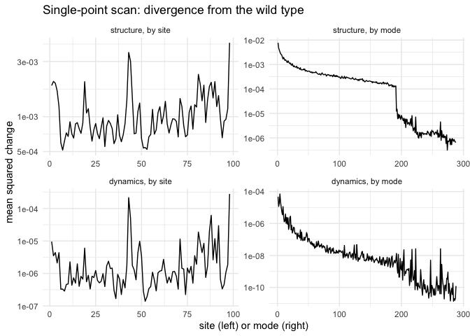
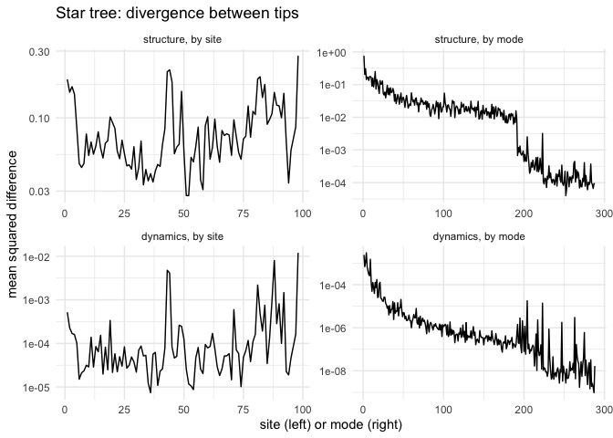
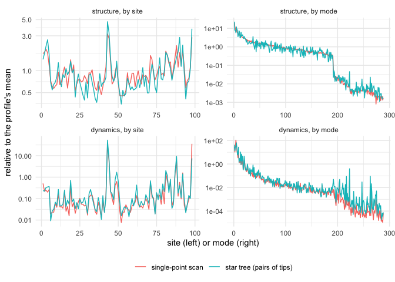

<!--
This vignette is precomputed: it takes several minutes to run. Edit THIS file
(genm.Rmd.orig), then regenerate genm.Rmd and its figures from the package root:

  Rscript -e 'devtools::load_all(); setwd("vignettes"); knitr::knit("genm.Rmd.orig", "genm.Rmd")'
-->


## The model

In the generalized elastic network model, a protein is a network of springs
between its residues. Each spring has an equilibrium length $l_{ij}$ and a
force constant $k_{ij} = k(l_{ij})$. The protein's structure is the minimum of
the potential $V = \frac12 \sum k_{ij} (d_{ij} - l_{ij})^2$, where $d_{ij}$ is
the distance between the two residues, and its dynamics follow from the Hessian
of $V$ at that minimum.

The springs' parameters depend on the protein's sequence. Each site carries an
allele, and a mutation changes the allele at one site, which changes the
$l_{ij}$ of that site's springs.

Two kinds of object carry this:

- an **enm** holds the parameters: the springs with their $l_{ij}$ and
  $k_{ij}$, the sequence of alleles, and the settings of the model. It has no
  structure.
- a **prot** is the protein those parameters imply: its enm, the minimum-energy
  structure, the minimum energy, the Hessian, and (when asked for) the normal
  modes.

This vignette uses the model in two ways: a complete scan of single-point
mutations, and a star tree of independent evolutionary trajectories. Both
measure how far proteins diverge, in structure and in dynamics, site by site
and mode by mode.

## Setup


```r
library(penm)
library(ggplot2)
```

The functions of the generalized model are not exported yet, while their
interface settles. Until they are, they have to be fetched from inside the
package:


```r
build_enm_from_pdb  <- penm:::build_enm_from_pdb
genm_mutate         <- penm:::genm_mutate
prot_from_enm       <- penm:::prot_from_enm
genm_add_nma        <- penm:::genm_add_nma
genm_superpose_prot <- penm:::genm_superpose_prot
calculate_enm_nodes <- penm:::calculate_enm_nodes
```

## The wild type

`build_enm_from_pdb()` makes the wild type's enm from a structure. It puts a
spring between every pair of residues closer than `d_max_pairs`, and every site
starts with allele 0, the residue in the pdb. The last four arguments define
what a mutation does: each site has `n_alleles` alleles, and each allele other
than 0 shifts the $l_{ij}$ of its site's springs by normal draws with standard
deviation `mut_dl_sigma` (in Å). Springs between sites fewer than `mut_sd_min`
apart in sequence are left alone, so with `mut_sd_min = 2` the bonds between
sequence neighbours never change. Which draw an allele gets is fixed by
`(ensemble, site, allele)`; see `?penm_ensemble`.


```r
wt_enm <- build_enm_from_pdb(
  pdb_2acy_A, node = "ca", model = "ming_wall", d_max = 10.5, d_max_pairs = 14,
  ensemble = 1, n_alleles = 10, mut_dl_sigma = 0.3, mut_sd_min = 2
)
names(wt_enm)
#> [1] "param"    "nodes"    "sequence" "graph"
```

`prot_from_enm()` makes the protein: it minimises the potential, starting from
the coordinates it is given. For the wild type the natural start is the pdb
structure itself. `genm_add_nma()` then adds the normal modes.


```r
xyz_pdb <- calculate_enm_nodes(pdb_2acy_A, "ca")$xyz

wt <- prot_from_enm(wt_enm, xyz_seed = xyz_pdb)
wt <- genm_add_nma(wt)
names(wt)
#> [1] "enm"          "nodes"        "v_min"        "kmat"         "nma"         
#> [6] "minimization"
```

With every allele at 0, every spring is at its rest length in the pdb
structure, so the minimum energy is zero:


```r
wt$v_min
#> [1] 0
```

Some quantities used throughout:


```r
sites   <- get_site(wt)               # 1 .. number of sites
modes   <- get_mode(wt)               # 1 .. number of normal modes, softest first
alleles <- 0:(wt_enm$param$n_alleles - 1)

c(sites = length(sites), modes = length(modes), springs = nrow(wt_enm$graph))
#>   sites   modes springs 
#>      98     288    1842
```

## What is measured

Each comparison is between two proteins, and gives four profiles:

- **structure, by site**: $|\delta \mathbf r_i|^2$, the squared displacement of
  site $i$ between the two structures, in Ų
  (`delta_structure_dr2i()`);
- **structure, by mode**: the squared displacement along each normal mode
  (`delta_structure_dr2n()`);
- **dynamics, by site**: the change in the mean-square fluctuation of each site
  (`delta_motion_dmsfi()`);
- **dynamics, by mode**: the change in the mean-square fluctuation along each
  normal mode (`delta_motion_dmsfn()`).

The structural measures are squares already. The dynamical ones are signed —
a site can become more or less mobile — so averaged over many comparisons they
would mostly cancel. They are squared first, so that all four profiles measure
divergence.

Mode profiles are taken along the wild type's modes in every comparison, so
that all of them share one basis.

## A complete single-point scan

A complete scan makes every single-point mutant of the wild type: at each site,
every allele other than the wild type's. Each mutant is minimised starting from
the wild-type structure, gets its normal modes, and is compared with the wild
type.


```r
n_mutants <- length(sites) * (length(alleles) - 1)

scan_dr2i  <- matrix(NA_real_, nrow = n_mutants, ncol = length(sites))
scan_dmsfi <- matrix(NA_real_, nrow = n_mutants, ncol = length(sites))
scan_dr2n  <- matrix(NA_real_, nrow = n_mutants, ncol = length(modes))
scan_dmsfn <- matrix(NA_real_, nrow = n_mutants, ncol = length(modes))

row <- 0
for (site in sites) {
  for (allele in setdiff(alleles, wt_enm$sequence[site])) {
    mutant_enm <- genm_mutate(wt_enm, site, allele)
    mutant <- prot_from_enm(mutant_enm, xyz_seed = get_xyz(wt))
    mutant <- genm_add_nma(mutant)

    row <- row + 1
    scan_dr2i[row, ]  <- delta_structure_dr2i(wt, mutant)
    scan_dr2n[row, ]  <- delta_structure_dr2n(wt, mutant)
    scan_dmsfi[row, ] <- delta_motion_dmsfi(wt, mutant)
    scan_dmsfn[row, ] <- delta_motion_dmsfn(wt, mutant)
  }
}
row
#> [1] 882
```

Each row of these matrices is one mutant, and each column a site or a mode. The
profiles are the means over mutants:


```r
scan_profile <- list(
  structure_by_site = colMeans(scan_dr2i),
  structure_by_mode = colMeans(scan_dr2n),
  dynamics_by_site  = colMeans(scan_dmsfi^2),
  dynamics_by_mode  = colMeans(scan_dmsfn^2)
)
```

To plot them, they go into one long table, one row per site or mode of each
profile:


```r
panels <- c("structure, by site", "structure, by mode",
            "dynamics, by site", "dynamics, by mode")

profile_table <- function(profile) {
  table <- rbind(
    tibble::tibble(panel = panels[1], index = sites, value = profile$structure_by_site),
    tibble::tibble(panel = panels[2], index = modes, value = profile$structure_by_mode),
    tibble::tibble(panel = panels[3], index = sites, value = profile$dynamics_by_site),
    tibble::tibble(panel = panels[4], index = modes, value = profile$dynamics_by_mode)
  )
  table$panel <- factor(table$panel, levels = panels)  # keep this panel order
  table
}

plot_profiles <- function(table, y_label, title) {
  ggplot(table, aes(index, value)) +
    geom_line() +
    facet_wrap(~ panel, scales = "free") +
    scale_y_log10() +
    labs(x = "site (left) or mode (right)", y = y_label, title = title) +
    theme_minimal()
}
```


```r
plot_profiles(profile_table(scan_profile),
              y_label = "mean squared change",
              title = "Single-point scan: divergence from the wild type")
```




Modes are numbered from the softest. The structural mode profile drops sharply
after mode 191: the last 97 modes are the
stretching of the 97 bonds between sequence neighbours. These are the
stiffest springs in this model (`ming_wall` makes them 42 times stiffer than the
rest), and the ones mutations leave alone (`mut_sd_min = 2`).

## A star tree

A trajectory starts from the wild type and accumulates mutations. At each step
a site is chosen at random and given a new allele, chosen at random among the
others, and the structure is minimised starting from the previous one. Running
several trajectories independently from the same wild type gives a star tree:
the wild type at the root, and one tip per trajectory.


```r
n_trajectories <- 20
n_steps <- 50

# one element of x, at random; sample(x, 1) would misbehave if x had length 1
pick_one <- function(x) x[sample.int(length(x), 1)]

set.seed(1)
tips <- vector("list", n_trajectories)
for (trajectory in seq_len(n_trajectories)) {
  protein <- wt
  for (step in seq_len(n_steps)) {
    site <- pick_one(sites)
    allele <- pick_one(setdiff(alleles, protein$enm$sequence[site]))
    mutant_enm <- genm_mutate(protein$enm, site, allele)
    protein <- prot_from_enm(mutant_enm, xyz_seed = get_xyz(protein))
  }
  tips[[trajectory]] <- protein
}
```

A site can be hit more than once along a trajectory, and a later mutation can
take it back to an allele it had before, the wild type's included. So after
50 mutations, the number of sites at which a tip differs from the wild
type is smaller:


```r
sites_changed <- sapply(tips, function(tip) sum(tip$enm$sequence != wt_enm$sequence))
summary(sites_changed)
#>    Min. 1st Qu.  Median    Mean 3rd Qu.    Max. 
#>   33.00   37.75   39.50   38.90   41.00   42.00
```

To be compared site by site, the tips must all have the same orientation.
`genm_superpose_prot()` rotates each tip onto the wild type's structure, and
recomputes its Hessian in the new orientation. Only the tips are compared, so
only they need normal modes, added afterwards:


```r
aligned_tips <- lapply(tips, genm_superpose_prot, target = get_xyz(wt))
aligned_tips <- lapply(aligned_tips, genm_add_nma)
```

The profiles compare **tips with each other**, not with the wild type: they
average over all 190 pairs of tips.

The site profiles use `delta_structure_dr2i()` and `delta_motion_dmsfi()`, as
the scan does. The mode profiles cannot use `delta_structure_dr2n()` and
`delta_motion_dmsfn()` directly: those take the modes of their first argument,
which here would be a different tip, and so a different basis, for each pair.
Instead, two small functions take the basis explicitly:


```r
# squared displacement from protein_1 to protein_2 along each column of basis
dr2_along <- function(protein_1, protein_2, basis) {
  displacement <- get_xyz(protein_2) - get_xyz(protein_1)
  as.vector(crossprod(basis, displacement))^2
}

# mean-square fluctuation of a protein along each column of basis, that is the
# diagonal of t(basis) %*% cmat %*% basis, computed without forming the product
msf_along <- function(protein, basis) {
  colSums(basis * (get_cmat(protein) %*% basis))
}

wt_modes <- get_umat(wt)
```

With the wild type as the first protein they give exactly what the `delta_*`
functions give:


```r
tip <- aligned_tips[[1]]
all.equal(dr2_along(wt, tip, wt_modes), delta_structure_dr2n(wt, tip))
#> [1] TRUE
all.equal(msf_along(tip, wt_modes) - msf_along(wt, wt_modes), delta_motion_dmsfn(wt, tip))
#> [1] TRUE
```


```r
pairs <- as.data.frame(t(combn(n_trajectories, 2)))
names(pairs) <- c("first", "second")
n_pairs <- nrow(pairs)

tree_dr2i  <- matrix(NA_real_, nrow = n_pairs, ncol = length(sites))
tree_dmsfi <- matrix(NA_real_, nrow = n_pairs, ncol = length(sites))
tree_dr2n  <- matrix(NA_real_, nrow = n_pairs, ncol = length(modes))
tree_dmsfn <- matrix(NA_real_, nrow = n_pairs, ncol = length(modes))

for (row in seq_len(n_pairs)) {
  tip_1 <- aligned_tips[[pairs$first[row]]]
  tip_2 <- aligned_tips[[pairs$second[row]]]

  tree_dr2i[row, ]  <- delta_structure_dr2i(tip_1, tip_2)
  tree_dmsfi[row, ] <- delta_motion_dmsfi(tip_1, tip_2)
  tree_dr2n[row, ]  <- dr2_along(tip_1, tip_2, wt_modes)
  tree_dmsfn[row, ] <- msf_along(tip_2, wt_modes) - msf_along(tip_1, wt_modes)
}

tree_profile <- list(
  structure_by_site = colMeans(tree_dr2i),
  structure_by_mode = colMeans(tree_dr2n),
  dynamics_by_site  = colMeans(tree_dmsfi^2),
  dynamics_by_mode  = colMeans(tree_dmsfn^2)
)
```


```r
plot_profiles(profile_table(tree_profile),
              y_label = "mean squared difference",
              title = "Star tree: divergence between tips")
```



## Scan and tree compared

The tips are separated by many mutations, so they differ far more than a
single mutant differs from the wild type. To compare the *shapes* of the
profiles, each is divided by its own mean:


```r
relative <- function(profile) lapply(profile, function(values) values / mean(values))

scan_table <- profile_table(relative(scan_profile))
tree_table <- profile_table(relative(tree_profile))
scan_table$source <- "single-point scan"
tree_table$source <- "star tree (pairs of tips)"

ggplot(rbind(scan_table, tree_table), aes(index, value, colour = source)) +
  geom_line() +
  facet_wrap(~ panel, scales = "free") +
  scale_y_log10() +
  labs(x = "site (left) or mode (right)", y = "relative to the profile's mean",
       colour = NULL) +
  theme_minimal() +
  theme(legend.position = "bottom")
```



How closely the shapes agree, as the correlation between the logarithms of the
scan profile and the tree profile:


```r
agreement <- c(
  "structure, by site" = cor(log(scan_profile$structure_by_site), log(tree_profile$structure_by_site)),
  "structure, by mode" = cor(log(scan_profile$structure_by_mode), log(tree_profile$structure_by_mode)),
  "dynamics, by site"  = cor(log(scan_profile$dynamics_by_site),  log(tree_profile$dynamics_by_site)),
  "dynamics, by mode"  = cor(log(scan_profile$dynamics_by_mode),  log(tree_profile$dynamics_by_mode))
)
round(agreement, 3)
#> structure, by site structure, by mode  dynamics, by site  dynamics, by mode 
#>              0.871              0.987              0.954              0.973
```

The single-point scan predicts the pattern in which tips separated by many
mutations differ from each other: the correlations range from
0.87 to 0.99.
